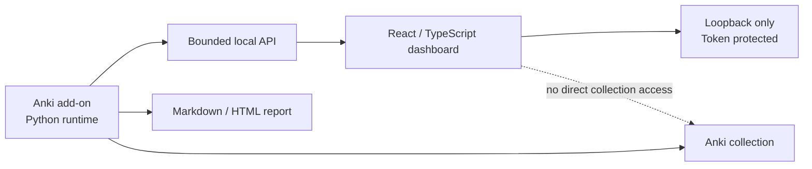

# Anki Study Report

Локальное расширение для **Anki 26.05+**: Python runtime собирает и анализирует учебные данные, а React/TypeScript dashboard показывает их в защищённом локальном интерфейсе.

> Проект находится в активной разработке. Стабильный публичный release ещё не объявлен.

## Что уже есть

- локальные страницы Today, Activity, Statistics/FSRS, Decks, Search, Cards и Profile;
- безопасные действия и bounded API без прямого доступа frontend к Anki collection;
- token-protected dashboard только на `127.0.0.1`;
- sanitizer и Shadow DOM для предпросмотра карточек без JavaScript execution surface;
- Fast CI, exact package handoff и real-Anki Docker E2E на трёх committed APKG;
- доказательства с проверяемой схемой для прогресса, ошибок, предварительных проверок, отмены и идентичности нерелизной сборки;
- каноническая итоговая сводка real-Anki E2E, bounded 90-day history и observational-only regression reporting;
- repository-owned exact Cards AV/audio/media gate с self-verifying evidence.

## Куда идти дальше

| Задача | Документ |
| --- | --- |
| Понять проект и архитектуру | [Обзор проекта](docs/project-overview.md) · [Архитектура](docs/architecture.md) |
| Найти актуальный контракт | [Индекс документации](docs/README.md) |
| Узнать текущее состояние | [AI handoff](docs/ai-handoff.md) |
| Посмотреть планы и зависимости | [Карта roadmap](roadmap/README.md) |
| Найти исторические подтверждения | [Индекс отчётов](reports/README.md) |
| Запустить проверки | [Матрица тестирования](docs/test-matrix.md) · [Политика запусков](docs/verification-run-policy.md) |
| Проверить exact Cards AV/media | [Cards exact AV/audio/media E2E](docs/cards-exact-av-media-e2e.md) |
| Собрать или выпустить add-on | [Packaging и release](docs/packaging-release.md) |
| Внести вклад | [CONTRIBUTING](CONTRIBUTING.md) · [Security policy](SECURITY.md) |

## Архитектура в одном экране



Основные каталоги:

```text
anki_study_report/   Python add-on, runtime и API
web-dashboard/       Vite + React + TypeScript
tests/               Python и contract tests
scripts/             build, package и verification
docker/anki-e2e/     real-Anki Desktop E2E
docs/                актуальные контракты
roadmap/             треки, зависимости и критерии
reports/             исторические отчёты и evidence
```

## Текущее направление

- **Core:** C1 завершён; базовая C2 implementation/integration влита. В draft PR #130 Stage 1 synchronization/rejected-overlay cleanup завершён. [Cards 1:1 production integration](docs/cards-v323-production-workspace.md), native CSS fidelity, AV/audio/media repair и финальный exact-card real-Anki evidence gate завершены и приняты владельцем: `ACCEPT CARDS 1:1`. Cards имеют статус `ACCEPTED / COMPLETE / FROZEN`; технических и accessibility blockers нет. Inspection Profiles 1:1 implementation не начата; PR #130 остаётся `OPEN / DRAFT / UNMERGED`, final verification, merge и C3 не выполнялись.
- **Platform / CI:** E2E-I1–E2E-I6 завершены; следующий Platform/CI этап не активирован автоматически и требует отдельного измеренного trigger.
- **Остальные треки:** Gamification, Operations, Identity и Extensions независимы или условны и не блокируют Core без явной зависимости.

Точные статусы и критерии находятся в [roadmap](roadmap/README.md); run IDs, SHA и исторические результаты — в [reports](reports/README.md).

## Основные инварианты

1. Frontend не читает Anki collection напрямую.
2. Dashboard остаётся loopback-only и token-protected.
3. Payload и публичное поведение меняются синхронно между backend, frontend types, tests и docs.
4. Sanitizer, media validation, action allowlists и preview isolation не ослабляются ради удобства.
5. Generated assets, logs, screenshots, profile data, tokens, `.ankiaddon` и E2E outputs не коммитятся.
6. Release, merge и публикация — отдельные явно одобряемые действия.
7. Real-Anki Docker E2E является integration gate, а не обычным циклом отладки.

## Основные команды

Canonical non-Docker check:

```powershell
.\scripts\run_full_check.ps1 -SkipDocker
```

Package validation:

```powershell
node scripts/run_python.mjs scripts/package_addon.py --check
```

Полный Docker E2E запускается только когда это оправдано риском изменения:

```powershell
.\scripts\run_full_check.ps1 -CleanDocker
```

## Лицензия

Проект распространяется по лицензии [GPL-3.0-only](LICENSE).
