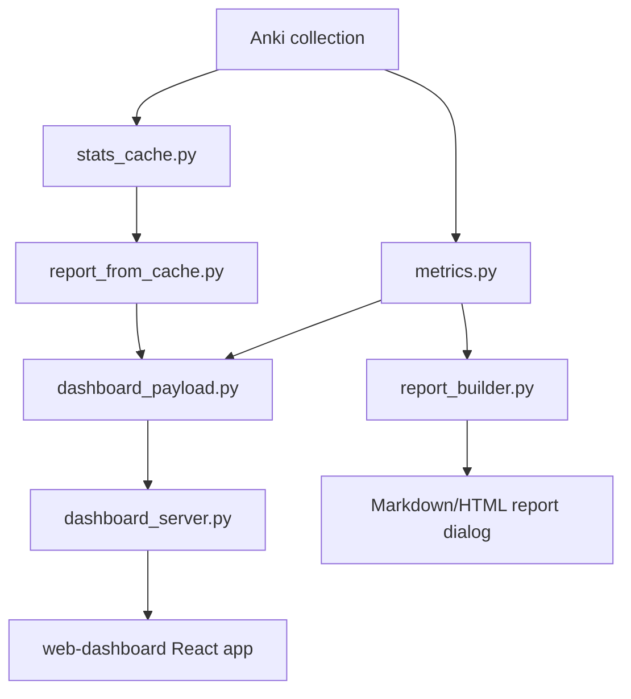

# Архитектура

Снимок документации: 2026-07-10.

## Общий поток данных



Главный принцип: Anki-зависимый код и UI orchestration остаются в
`__init__.py`, а преобразования данных по возможности вынесены в чистые модули,
которые можно импортировать и тестировать без установленного Anki.

## Python add-on

`anki_study_report/__init__.py` - entrypoint Anki add-on. Он:

- импортирует `aqt`, регистрирует меню и hooks;
- создает диалоги `StudyReportDialog`, `IntegrationDiagnosticsDialog`,
  `WebDashboardSettingsDialog`, `LauncherDialog`;
- управляет dashboard server lifecycle;
- соединяет cache, сбор метрик, публикацию dashboard report и UI actions;
- содержит E2E bootstrap, который активен только при `ANKI_STUDY_REPORT_E2E=1`.

Важно: этот файл намеренно остается adapter/orchestration layer. Когда
появляется новая чистая логика трансформации данных, ее лучше выносить в
отдельный модуль и покрывать тестами без Anki.

## Метрики и отчеты

`metrics.py` собирает основные данные из Anki collection:

- total reviews, new cards, answer distribution;
- deck breakdown;
- due tomorrow;
- FSRS-related данные;
- attention cards и note type diagnostics;
- pass/fail метрики.

`heatmap_metrics.py` отвечает за календарную активность и streaks.

`forecast_metrics.py` строит легкий прогноз нагрузки.

`report_builder.py` рендерит Markdown/HTML отчет для Anki dialog.

`study_time_integration.py` и `session_tracker.py` дают альтернативные источники
реального времени обучения, если соответствующие настройки включены.

## Cache layer

`stats_cache.py` управляет SQLite cache в runtime data директории профиля Anki:

```text
<profile>/addon_data/<addon_id>/study_report_cache.sqlite3
```

Если профиль недоступен, fallback - `anki_study_report/user_files/`.

`report_from_cache.py` адаптирует cache snapshot в части отчета. Он нужен,
чтобы dashboard мог быстро показывать долгие периоды и историю без полного
пересчета legacy-метрик каждый раз.

Кэш не должен менять публичный dashboard contract. Если cache и legacy дают
разную форму данных, адаптер обязан привести ее к тому же payload.

`profile_service.py` получает исходный all-collection snapshot до применения
dashboard period/deck filters. Он строит compact Profile slice и обслуживает
атомарный `<runtime>/profile.json`; frontend не сканирует collection и не
пересчитывает raw revlog.

`activity_service.py` получает тот же snapshot, но применяет текущий historical
dashboard deck scope. Он публикует bounded one-year `activityHub`, day-deck
details и derived daily/weekly events; старый `activity` contract остаётся для
Home/backward compatibility.

`deck_hub.py` объединяет current Anki deck catalog с теми же scoped direct
deck rows. Он исключает filtered decks, сохраняет structural ancestors,
агрегирует subtree bottom-up и публикует normalized `deckHub`. Cache schema v2
использует current home deck (`odid`) для карт во filtered deck.

## Dashboard payload

`dashboard_payload.py` - чистый слой трансформации метрик в JSON. Его ключевые
entrypoints:

- `build_dashboard_report_payload(metrics, metadata, cache_summary=None)`
- `build_default_dashboard_metadata(snapshot, today_key, display_settings=None, now=None)`
- `metrics_from_cache_snapshot(snapshot, today_key, display_settings=None)`

Payload должен соответствовать `web-dashboard/src/types/report.ts`.

Текущие top-level ключи:

```text
metadata
summary
kpis
answerDistribution
activity
comparison
decks
attentionCards
attentionCardsStatus
noteTypeCatalog
forecast
fsrs
recommendations
cache
today (optional Home-only slice)
profile (all-collection lifetime slice)
activityHub (scoped bounded Activity slice)
deckHub (scoped normalized Decks v2 hierarchy)
```

## Dashboard server

`dashboard_server.py` поднимает локальный HTTP server на `127.0.0.1`. Он:

- отдает static frontend из `anki_study_report/web_dashboard`;
- защищает report/API token-ом;
- публикует последний report payload в памяти;
- обслуживает media-preview безопасным allowlist/sanitizer путем;
- прокидывает dashboard actions обратно в Anki через callbacks.
- обслуживает narrow token-protected `GET/POST /api/profile`.

Frontend не должен иметь прямой доступ к Anki collection. Все действия идут
через API server и контролируются Python side.

Security details: `docs/security-and-safety.md`.

## Frontend dashboard

`web-dashboard` - Vite + React + TypeScript приложение.

`web-dashboard/src/app/App.tsx` читает token из query string и грузит:

```text
/api/report?token=<token>
```

В development mode, если API недоступен и ошибка не `403`, приложение может
подставить `mockReport`. В production это не должно маскировать проблему
реального dashboard server.

Hash router находится в `web-dashboard/src/app/router.tsx`. Текущие страницы:

```text
#/home
#/profile
#/decks
#/cards
#/calendar
#/actions
#/settings
#/settings/data
#/settings/server
#/settings/sources
#/settings/logs
```

Старые placeholder routes `#/stats`, `#/fsrs` и `#/browse` удалены в Stage 15.
Их данные и реальные workflows уже покрываются `HomePage`, `CalendarPage`,
`ActionsPage` и `CardsPage`; unknown hash fallback ведёт на `#/home`.

Видимая primary navigation отделена от полного registry routes. Она содержит
только `Сегодня`, `Активность`, `Колоды` и `Карточки`. `TopNav.tsx` размещает
Profile/Settings/Tools в avatar dropdown, а `SettingsLayout.tsx` связывает
report/data/server/sources/logs постоянным Settings Hub sidebar. Старые
`#/integrations` и `#/logs` redirect-ятся в canonical diagnostics routes.
Технические страницы не показываются как основные аналитические вкладки.

Подробная карта frontend routes/pages/helpers: `docs/frontend-map.md`.
Продуктовое решение по навигации: `docs/navigation-ia.md`.

## Runtime data

Runtime data хранится отдельно от исходников, когда Anki profile доступен:

```text
<profile>/addon_data/<addon_id>/
```

Там размещаются cache, `profile.json` и logs. Старый `anki_study_report/user_files/`
используется как fallback и мигрируется при возможности.

В git не должны попадать:

```text
anki_study_report/user_files/*.sqlite3
anki_study_report/user_files/logs/*.log*
e2e-artifacts/
web-dashboard/dist/
anki_study_report/web_dashboard/
*.ankiaddon
```
