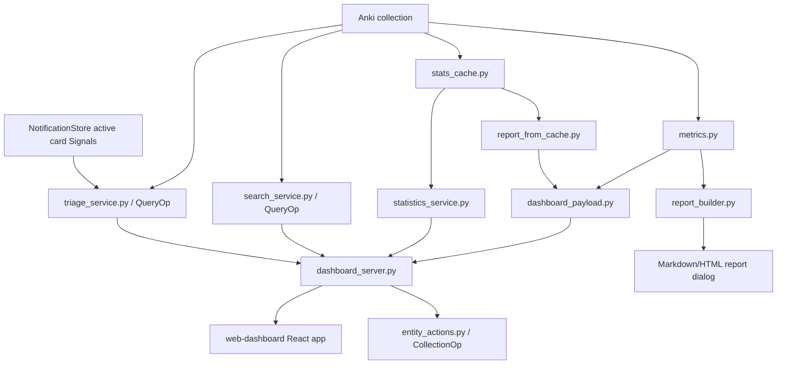

# Архитектура

**Снимок документации:** 2026-07-15

## Общий поток данных



Главный принцип: Anki-dependent code и UI orchestration остаются в `__init__.py`, а чистые преобразования данных по возможности выносятся в отдельные модули, которые можно импортировать и тестировать без установленного Anki.

## Python add-on

`anki_study_report/__init__.py` — entrypoint Anki add-on. Он:

- импортирует `aqt`, регистрирует menu и hooks;
- создаёт dialogs `StudyReportDialog`, `IntegrationDiagnosticsDialog`, `WebDashboardSettingsDialog`, `LauncherDialog`;
- управляет lifecycle dashboard server;
- связывает cache, сбор metrics, публикацию dashboard report и UI actions;
- содержит E2E bootstrap, активный только при `ANKI_STUDY_REPORT_E2E=1`.

Этот файл намеренно остаётся adapter/orchestration layer. Новую чистую transformation logic следует выносить в отдельный module и покрывать tests без Anki.

## Metrics и reports

`metrics.py` собирает основные данные из Anki collection:

- total reviews;
- new cards;
- answer distribution;
- deck breakdown;
- due tomorrow;
- FSRS-related data;
- attention cards и diagnostics note type;
- pass/fail metrics.

Дополнительные модули:

- `heatmap_metrics.py` — calendar activity и streaks;
- `forecast_metrics.py` — лёгкий workload forecast;
- `report_builder.py` — Markdown/HTML report для Anki dialog;
- `study_time_integration.py` и `session_tracker.py` — альтернативные источники реального study time, когда включены соответствующие settings.

## Cache layer

`stats_cache.py` управляет SQLite cache в runtime data директории Anki profile:

```text
<profile>/addon_data/<addon_id>/study_report_cache.sqlite3
```

Если profile недоступен, используется fallback:

```text
anki_study_report/user_files/
```

`report_from_cache.py` преобразует cache snapshot в части report, чтобы dashboard мог быстро показывать длинные периоды и history без полного пересчёта legacy metrics.

Cache не должен менять public dashboard contract. Если cache и legacy дают разную shape, adapter обязан привести их к одному payload.

`profile_service.py` получает исходный all-collection snapshot до применения period/deck filters dashboard. Он создаёт compact Profile slice и обслуживает atomic `<runtime>/profile.json`. Frontend не сканирует collection и не пересчитывает raw revlog.

`activity_service.py` использует тот же snapshot, но применяет текущий historical deck scope dashboard. Он публикует:

- bounded one-year `activityHub`;
- day-deck details;
- derived daily/weekly events.

Старый `activity` contract сохраняется для Home/backward compatibility.

`deck_hub.py` объединяет current Anki deck catalog с теми же scoped direct deck rows. Он:

- исключает filtered decks;
- сохраняет structural ancestors;
- агрегирует subtree bottom-up;
- публикует normalized `deckHub`.

Cache schema v3 использует current home deck (`odid`) для cards во filtered deck.

## Dashboard payload

`dashboard_payload.py` — чистый слой преобразования metrics в JSON.

Ключевые entrypoints:

```text
build_dashboard_report_payload(metrics, metadata, cache_summary=None)
build_default_dashboard_metadata(snapshot, today_key, display_settings=None, now=None)
metrics_from_cache_snapshot(snapshot, today_key, display_settings=None)
```

Payload должен соответствовать `web-dashboard/src/types/report.ts`.

Текущие top-level keys:

```text
metadata
summary
kpis
answerDistribution
activity
comparison
decks
attentionCards
attentionCardsStatus
noteTypeCatalog
forecast
fsrs
recommendations
cache
today (optional Home-only slice)
profile (all-collection lifetime slice)
activityHub (scoped bounded Activity slice)
deckHub (scoped normalized Decks v2 hierarchy)
statisticsHub (bounded initial 90d Statistics result)
```

## Dashboard server

`dashboard_server.py` поднимает локальный HTTP server на `127.0.0.1`.

Он:

- отдаёт static frontend из `anki_study_report/web_dashboard`;
- защищает report/API token;
- хранит последний report payload в памяти;
- обслуживает media preview через allowlist/sanitizer;
- передаёт dashboard actions в Anki через callbacks;
- обслуживает narrow token-protected `GET/POST /api/profile`;
- обслуживает narrow token-protected `POST /api/statistics/query`;
- обслуживает read-only `POST /api/search/query` и `/api/search/inspect`;
- обслуживает additive read-only `POST /api/triage/query`;
- обслуживает `POST /api/inspection-profiles/query|validate|update`;
- обслуживает отдельные card/note mutation endpoints.

### Search

Collection work выполняется serialized `QueryOp` через `search_runtime.py`. Validation и projection изолированы в `search_service.py`.

### Triage

`triage_runtime.py` сериализует collection read через `QueryOp`.

`triage_service.py` объединяет в bounded deterministic projection:

- существующий attention collector;
- active card Signals;
- exact Search card rows;
- confirmed-profile content checks.

Triage не создаёт persistence, не изменяет collection и не передаёт full preview.

### Inspection Profiles

`inspection_profile_runtime.py` сериализует model/card reads через `QueryOp`.

`inspection_profile_service.py` отвечает за:

- structures;
- fingerprints;
- lifecycle;
- allowlisted evaluation.

`inspection_profile_store.py` отвечает только за:

- strict validation;
- revision;
- atomic profile-local persistence;
- recovery.

### Safe Actions

Strict validation и preflight находятся в `entity_actions.py`. Bridge к official Anki wrappers находится в `entity_action_runtime.py`.

Frontend не должен получать прямой доступ к Anki collection. Все действия проходят через API server и контролируются Python side.

`metrics.py` сохраняет legacy attention behavior и отдельно предоставляет bounded internal candidate DTO для Triage.

Источники ответственности:

- `NotificationStore` — Signals;
- `search_service.project_card_row()` — compact identity;
- `InspectionProfileStore` — per-profile configuration;
- Triage — объединение sources, независимые learning reasons и только confirmed/current content failures.

Контракты:

- [`cards-v2-triage-read-api.md`](cards-v2-triage-read-api.md);
- [`inspection-profiles-v1.md`](inspection-profiles-v1.md);
- [`security-and-safety.md`](security-and-safety.md).

## Frontend dashboard

`web-dashboard` — приложение Vite + React + TypeScript.

`web-dashboard/src/app/App.tsx` читает token из query string и запрашивает:

```text
/api/report?token=<token>
```

В development mode при недоступном API и ошибке, отличной от `403`, приложение может использовать `mockReport`. В production это не должно скрывать проблему реального dashboard server.

Hash router находится в `web-dashboard/src/app/router.tsx`.

Текущие routes:

```text
#/home
#/profile
#/decks
#/cards
#/search
#/calendar
#/stats
#/stats/quality
#/stats/load
#/stats/progress
#/stats/decks
#/actions
#/settings
#/settings/data
#/settings/server
#/settings/sources
#/settings/logs
```

Placeholder routes `#/fsrs` и `#/browse` удалены в Stage 15. `#/stats` вернулся только вместе с полноценным Statistics v1. Unknown hash fallback ведёт на `#/home`.

Visible primary navigation отделена от полного registry routes и содержит:

```text
Сегодня
Активность
Статистика
Колоды
Карточки
```

`TopNav.tsx` размещает Profile/Settings/Tools в avatar dropdown.

`SettingsLayout.tsx` связывает report/data/server/sources/logs постоянным Settings Hub sidebar. Старые `#/integrations` и `#/logs` перенаправляются в canonical diagnostics routes. Технические страницы не показываются как основные аналитические tabs.

`AppLayout` владеет persistent `GlobalUtilityDock` вне route content.

Theme preference:

```text
light | dark | system
```

Она хранится в browser и применяется inline до React render. Dock фиксирует explicit light/dark без backend API.

Независимый selector языка:

```text
ru | en
```

`i18next` и `react-i18next` загружают bundled resources до первого render. Русский используется как default/fallback. Browser-local выбор хранится в `anki-study-report-language`.

Смена языка не меняет payload/API и синхронно обновляет:

- product UI;
- `html lang`;
- `document.title`.

Связанные документы:

- [`localization.md`](localization.md);
- [`frontend-map.md`](frontend-map.md);
- [`navigation-ia.md`](navigation-ia.md);
- [`search-v1-and-safe-actions.md`](search-v1-and-safe-actions.md).

## Local Signals и Notifications

`signal_detection.py` вычисляет четыре bounded detector families из cache snapshot, Deck Hub и одного grouped `revlog` query.

`notification_store.py` владеет отдельной per-profile SQLite schema, reconciliation и preferences.

`__init__.py` повторно привязывает stores при открытии profile и публикует strict handlers в `dashboard_server.py`.

React читает данные через `notificationsApi.ts`. App Shell монтирует bell/toasts, а route pages остаются lazy boundaries.

Этот поток не соединён с `TelemetryClient`.

## FSRS adapter

`fsrs_service.py` — изолированный read-only Anki adapter и pure aggregate layer.

`statistics_service.py` публикует только lightweight capability, а `dashboard_server.py` предоставляет strict token-protected FSRS operation union.

## Runtime data

При доступном Anki profile runtime data хранится отдельно от исходников:

```text
<profile>/addon_data/<addon_id>/
```

Там находятся cache, `profile.json` и logs.

Старый `anki_study_report/user_files/` используется как fallback и мигрируется при возможности.

В Git не должны попадать:

```text
anki_study_report/user_files/*.sqlite3
anki_study_report/user_files/logs/*.log*
e2e-artifacts/
web-dashboard/dist/
anki_study_report/web_dashboard/
*.ankiaddon
```

## Product notices и privacy state

`product_notices.py` владеет двумя atomic per-profile JSON stores и strict consent validation.

`dashboard_server.py` публикует token-protected local API, а `ProductNoticeCoordinator` последовательно показывает consent и What’s New.

`release/changelog.json` является canonical source. Markdown и bundled RU/EN assets генерируются.

Этот слой работает offline и не является telemetry sender.

Отдельный Python client:

- валидирует semantic events;
- хранит bounded per-profile SQLite queue;
- выполняет consent-gated background delivery.

React не знает remote endpoint или credentials.

Контракты:

- `docs/product-notices-and-consent.md`;
- `docs/telemetry-client.md`.

## Declarative compact formatter runtime

C1.5R.2 добавляет независимый per-profile path:

```text
<profile>/addon_data/<addon-id>/card_display_formatters.json
```

Поток:

```text
DashboardServerManager handlers
→ CardDisplayFormatterStore читается один раз на Search/Triage request
→ immutable CardDisplayFormatterResolver
→ Search exact-card projector
→ Triage переиспользует Search-owned card rows
→ canonical R1 fallback при любой ошибке formatter/store
```

Store отделён от:

- `inspection_profiles.json`;
- global add-on config;
- collection data;
- note types;
- templates.

Используются strict schema v1, deterministic atomic JSON writes, optimistic revision conflicts, corruption quarantine и future-schema preserve/fail-closed behavior.

Formatter parser создаёт только bounded ordered tokens text/line/image/audio. Он не выполняет пользовательскую программу, не читает media files, не загружает remote resources и не меняет Inspector/expanded preview.

Контракт:

- [`card-display-formatter-v1.md`](card-display-formatter-v1.md).

## Preview semantics C1.5R.3

См. [`card-preview-semantics.md`](card-preview-semantics.md). Full preview использует reviewer/native front и answer: Inspector показывает front, expanded dialog — answer, compact identity остаётся неизменной.

## Independent candidate sources C1.5R.4

См. [`triage-candidate-sources-v4.md`](triage-candidate-sources-v4.md). Triage schema v4 разделяет bounded period learning candidates и current-content candidates.