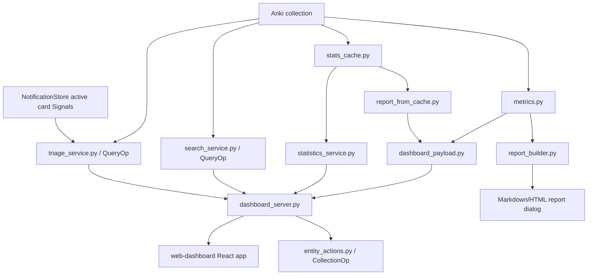

# Архитектура

**Снимок документации:** 2026-07-15

## Общий поток данных



Главный принцип: зависящие от Anki части и orchestration UI остаются в `__init__.py`, а чистые преобразования данных по возможности выносятся в отдельные модули, которые можно импортировать и тестировать без установленного Anki.

## Python add-on

`anki_study_report/__init__.py` — точка входа add-on Anki. Он:

- импортирует `aqt`, регистрирует меню и hooks;
- создаёт диалоги `StudyReportDialog`, `IntegrationDiagnosticsDialog`, `WebDashboardSettingsDialog`, `LauncherDialog`;
- управляет жизненным циклом server dashboard;
- связывает cache, сбор метрик, публикацию отчёта dashboard и действия UI;
- содержит E2E-bootstrap, активный только при `ANKI_STUDY_REPORT_E2E=1`.

Этот файл намеренно остаётся слоем adapter и orchestration. Новую чистую логику преобразования следует выносить в отдельный модуль и покрывать тестами без Anki.

## Метрики и отчёты

`metrics.py` собирает основные данные из collection Anki:

- общее количество повторений;
- новые карточки;
- распределение ответов;
- разбивку по колодам;
- карточки на завтра;
- данные, связанные с FSRS;
- карточки, требующие внимания, и диагностику типов заметок;
- метрики успешных и неуспешных ответов.

Дополнительные модули:

- `heatmap_metrics.py` — календарная активность и streaks;
- `forecast_metrics.py` — лёгкий прогноз нагрузки;
- `report_builder.py` — отчёт Markdown/HTML для диалога Anki;
- `study_time_integration.py` и `session_tracker.py` — альтернативные источники реального времени обучения, когда включены соответствующие настройки.

## Слой cache

`stats_cache.py` управляет SQLite-cache в каталоге runtime-данных профиля Anki:

```text
<profile>/addon_data/<addon_id>/study_report_cache.sqlite3
```

Если профиль недоступен, используется fallback:

```text
anki_study_report/user_files/
```

`report_from_cache.py` преобразует snapshot cache в части отчёта, чтобы dashboard мог быстро показывать длинные периоды и историю без полного пересчёта устаревших метрик.

Cache не должен менять публичный контракт dashboard. Если cache и устаревший путь возвращают разную структуру, adapter обязан привести их к одному payload.

`profile_service.py` получает исходный snapshot всей collection до применения фильтров периода и колоды dashboard. Он создаёт компактный раздел Profile и обслуживает атомарный файл `<runtime>/profile.json`. Frontend не сканирует collection и не пересчитывает необработанный revlog.

`activity_service.py` использует тот же snapshot, но применяет текущий исторический scope колод dashboard. Он публикует:

- ограниченный годовой `activityHub`;
- подробности дня и колоды;
- производные дневные и недельные события.

Старый контракт `activity` сохраняется для Home и обратной совместимости.

`deck_hub.py` объединяет актуальный каталог колод Anki с теми же строками непосредственных колод в выбранном scope. Он:

- исключает filtered decks;
- сохраняет структурных предков;
- агрегирует subtree снизу вверх;
- публикует нормализованный `deckHub`.

Schema v3 cache использует актуальную домашнюю колоду (`odid`) для карточек в filtered deck.

## Payload dashboard

`dashboard_payload.py` — чистый слой преобразования метрик в JSON.

Ключевые точки входа:

```text
build_dashboard_report_payload(metrics, metadata, cache_summary=None)
build_default_dashboard_metadata(snapshot, today_key, display_settings=None, now=None)
metrics_from_cache_snapshot(snapshot, today_key, display_settings=None)
```

Payload должен соответствовать `web-dashboard/src/types/report.ts`.

Текущие ключи верхнего уровня:

```text
metadata
summary
kpis
answerDistribution
activity
comparison
decks
attentionCards
attentionCardsStatus
noteTypeCatalog
forecast
fsrs
recommendations
cache
today (необязательный раздел только для Home)
profile (статистика за всё время по всей collection)
activityHub (ограниченная активность в выбранном scope)
deckHub (нормализованная иерархия Decks v2 в выбранном scope)
statisticsHub (ограниченный начальный результат Statistics за 90 дней)
```

## Server dashboard

`dashboard_server.py` поднимает локальный HTTP-server на `127.0.0.1`.

Он:

- отдаёт статический frontend из `anki_study_report/web_dashboard`;
- защищает отчёт и API токеном;
- хранит последний payload отчёта в памяти;
- обслуживает media предпросмотра через allowlist и sanitizer;
- передаёт действия dashboard в Anki через callbacks;
- обслуживает узкий защищённый токеном `GET/POST /api/profile`;
- обслуживает узкий защищённый токеном `POST /api/statistics/query`;
- обслуживает read-only `POST /api/search/query` и `/api/search/inspect`;
- обслуживает добавочный read-only `POST /api/triage/query`;
- обслуживает `POST /api/inspection-profiles/query|validate|update`;
- обслуживает отдельные endpoints mutations карточек и заметок.

### Search

Работа с collection выполняется сериализованным `QueryOp` через `search_runtime.py`. Validation и projection изолированы в `search_service.py`.

### Triage

`triage_runtime.py` сериализует чтение collection через `QueryOp`.

`triage_service.py` объединяет в ограниченную детерминированную проекцию:

- существующий collector attention cards;
- активные Signals карточек;
- строки точных карточек Search;
- проверки содержимого подтверждённых профилей.

Triage не создаёт постоянное состояние, не изменяет collection и не передаёт полный предпросмотр.

### Inspection Profiles

`inspection_profile_runtime.py` сериализует чтение моделей и карточек через `QueryOp`.

`inspection_profile_service.py` отвечает за:

- структуры;
- fingerprints;
- жизненный цикл;
- оценку по allowlist.

`inspection_profile_store.py` отвечает только за:

- строгую validation;
- revision;
- атомарное хранение на уровне профиля;
- восстановление.

### Safe Actions

Строгая validation и preflight находятся в `entity_actions.py`. Bridge к официальным wrappers Anki находится в `entity_action_runtime.py`.

Frontend не должен получать прямой доступ к collection Anki. Все действия проходят через API-server и контролируются Python-стороной.

`metrics.py` сохраняет устаревшее поведение attention cards и отдельно предоставляет ограниченный внутренний DTO кандидатов для Triage.

Источники ответственности:

- `NotificationStore` — Signals;
- `search_service.project_card_row()` — компактная идентичность;
- `InspectionProfileStore` — конфигурация на уровне профиля;
- Triage — объединение источников, независимые причины обучения и только ошибки содержимого подтверждённых и актуальных профилей.

Контракты:

- [`cards-v2-triage-read-api.md`](cards-v2-triage-read-api.md);
- [`inspection-profiles-v1.md`](inspection-profiles-v1.md);
- [`security-and-safety.md`](security-and-safety.md).

## Frontend dashboard

`web-dashboard` — приложение Vite + React + TypeScript.

`web-dashboard/src/app/App.tsx` читает токен из query string и запрашивает:

```text
/api/report?token=<token>
```

В development-режиме при недоступном API и ошибке, отличной от `403`, приложение может использовать `mockReport`. В production это не должно скрывать проблему настоящего server dashboard.

Hash-router находится в `web-dashboard/src/app/router.tsx`.

Текущие маршруты:

```text
#/home
#/profile
#/decks
#/cards
#/search
#/calendar
#/stats
#/stats/quality
#/stats/load
#/stats/progress
#/stats/decks
#/actions
#/settings
#/settings/data
#/settings/server
#/settings/sources
#/settings/logs
```

Placeholder-маршруты `#/fsrs` и `#/browse` удалены в Stage 15. `#/stats` вернулся только вместе с полноценным Statistics v1. Fallback неизвестного hash ведёт на `#/home`.

Видимая основная навигация отделена от полного registry маршрутов и содержит:

```text
Сегодня
Активность
Статистика
Колоды
Карточки
```

`TopNav.tsx` размещает Profile, Settings и Tools в dropdown аватара.

`SettingsLayout.tsx` связывает отчёт, данные, server, sources и logs постоянной боковой панелью Settings Hub. Старые `#/integrations` и `#/logs` перенаправляются на канонические диагностические маршруты. Технические страницы не показываются как основные аналитические tabs.

`AppLayout` отвечает за постоянный `GlobalUtilityDock` вне содержимого маршрута.

Настройка темы:

```text
light | dark | system
```

Она хранится в browser и применяется inline до рендера React. Dock явно переключает light и dark без backend API.

Независимый выбор языка:

```text
ru | en
```

`i18next` и `react-i18next` загружают встроенные resources до первого рендера. Русский используется по умолчанию и как fallback. Локальный выбор browser хранится в `anki-study-report-language`.

Смена языка не меняет payload или API и синхронно обновляет:

- продуктовый UI;
- `html lang`;
- `document.title`.

Связанные документы:

- [`localization.md`](localization.md);
- [`frontend-map.md`](frontend-map.md);
- [`navigation-ia.md`](navigation-ia.md);
- [`search-v1-and-safe-actions.md`](search-v1-and-safe-actions.md).

## Локальные Signals и Notifications

`signal_detection.py` вычисляет четыре ограниченных семейства детекторов из snapshot cache, Deck Hub и одного сгруппированного запроса `revlog`.

`notification_store.py` отвечает за отдельную SQLite-schema на уровне профиля, reconciliation и preferences.

`__init__.py` повторно привязывает stores при открытии профиля и публикует строгие handlers в `dashboard_server.py`.

React читает данные через `notificationsApi.ts`. Оболочка приложения монтирует bell и toasts, а страницы маршрутов остаются lazy-boundaries.

Этот поток не связан с `TelemetryClient`.

## Adapter FSRS

`fsrs_service.py` — изолированный read-only-adapter Anki и чистый слой агрегации.

`statistics_service.py` публикует только лёгкую capability, а `dashboard_server.py` предоставляет строгий защищённый токеном union операций FSRS.

## Runtime-данные

При доступном профиле Anki runtime-данные хранятся отдельно от исходников:

```text
<profile>/addon_data/<addon_id>/
```

Там находятся cache, `profile.json` и logs.

Старый `anki_study_report/user_files/` используется как fallback и при возможности мигрируется.

В Git не должны попадать:

```text
anki_study_report/user_files/*.sqlite3
anki_study_report/user_files/logs/*.log*
e2e-artifacts/
web-dashboard/dist/
anki_study_report/web_dashboard/
*.ankiaddon
```

## Product notices и состояние конфиденциальности

`product_notices.py` отвечает за два атомарных JSON-хранилища на уровне профиля и строгую validation согласия.

`dashboard_server.py` публикует защищённый токеном локальный API, а `ProductNoticeCoordinator` последовательно показывает запрос согласия и What’s New.

`release/changelog.json` является каноническим источником. Markdown и встроенные assets RU/EN генерируются.

Этот слой работает offline и не является отправителем телеметрии.

Отдельный Python-client:

- валидирует семантические события;
- хранит ограниченную SQLite-очередь на уровне профиля;
- выполняет фоновую доставку только после согласия.

React не знает удалённый endpoint или credentials.

Контракты:

- `docs/product-notices-and-consent.md`;
- `docs/telemetry-client.md`.

## Декларативный runtime компактного форматтера

C1.5R.2 добавляет независимый путь на уровне профиля:

```text
<profile>/addon_data/<addon-id>/card_display_formatters.json
```

Поток:

```text
handlers DashboardServerManager
→ CardDisplayFormatterStore читается один раз на запрос Search или Triage
→ неизменяемый CardDisplayFormatterResolver
→ projector точной карточки Search
→ Triage переиспользует строки карточек, принадлежащие Search
→ канонический fallback R1 при любой ошибке formatter или store
```

Store отделён от:

- `inspection_profiles.json`;
- глобальной конфигурации add-on;
- данных collection;
- типов заметок;
- шаблонов.

Используются строгая schema v1, детерминированные атомарные записи JSON, конфликты optimistic revision, quarantine повреждённых данных и сохранение будущей schema с fail-closed-поведением.

Parser форматтера создаёт только ограниченные упорядоченные токены text, line, image и audio. Он не выполняет пользовательскую программу, не читает media-файлы, не загружает удалённые resources и не меняет Inspector или расширенный предпросмотр.

Контракт:

- [`card-display-formatter-v1.md`](card-display-formatter-v1.md).

## Семантика предпросмотра C1.5R.3

См. [`card-preview-semantics.md`](card-preview-semantics.md). Полный предпросмотр использует нативные лицевую сторону и ответ reviewer: Inspector показывает лицевую сторону, расширенный диалог — ответ, компактная идентичность не меняется.

## Независимые источники кандидатов C1.5R.4

См. [`triage-candidate-sources-v4.md`](triage-candidate-sources-v4.md). Schema v4 Triage разделяет кандидатов обучения за ограниченный период и кандидатов по текущему содержимому.
