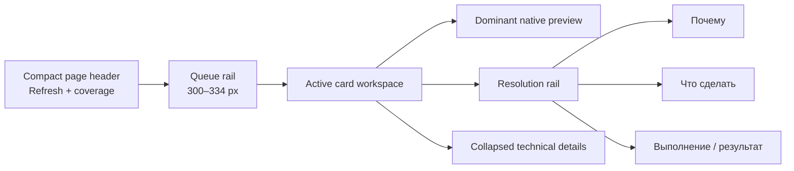
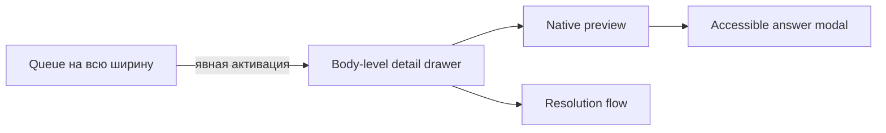
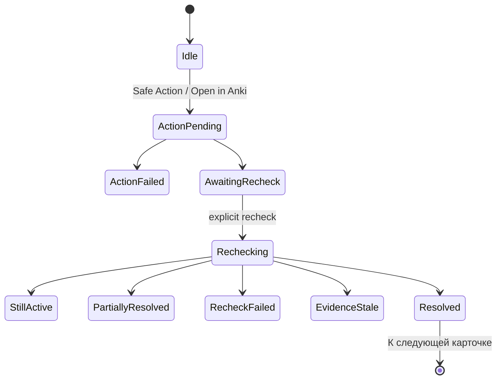

# Cards workspace по Prototype v3.2.3

**Статус:** актуальный production UI contract для `#/cards` в draft PR #130  
**Снимок:** 2026-07-26  
**Implementation head:** `1f78b69574794c67149796343dde8cbdd4948fb4`  
**Owner visual acceptance:** pending  
**Следующий этап:** Inspection Profiles 1:1 только после решения владельца по Cards

## Назначение

Этот документ фиксирует перенос принятого standalone Prototype v3.2.3 в настоящую React/TypeScript production-композицию `#/cards`.

Он описывает:

- фактическую visual hierarchy страницы;
- wide desktop и 1024 drawer composition;
- порядок queue → preview → resolution;
- проекции action/recheck/refresh/resolved;
- focus, modal, drawer и reduced-motion contracts;
- границы, которые не менялись при visual recomposition.

API, detector и security contracts остаются в профильных документах:

- [Cards attention inbox](cards-attention-inbox.md);
- [Canonical single-card resolution loop](cards-v2-resolution-loop.md);
- [Card preview semantics](card-preview-semantics.md);
- [Triage read API](cards-v2-triage-read-api.md);
- [Security and safety](security-and-safety.md).

При конфликте старого описания C1.5/C1.6 layout с этим документом current production code/tests и этот composition contract имеют приоритет. Исторические решения не переписываются задним числом.

## 1. Пользовательская задача

`#/cards` — bounded attention workspace, а не общая таблица, редактор или карточный browser.

Пользователь должен:

1. быстро увидеть компактную очередь проблем;
2. выбрать одну карточку;
3. распознать карточку по нативному preview;
4. понять причину и рекомендуемое действие;
5. выполнить существующий safe path;
6. увидеть локальный результат и запустить authoritative recheck;
7. после подтверждённого устранения перейти к следующей карточке.

Каждая область страницы обязана обслуживать один из этих шагов. Техническая диагностика остаётся свёрнутой.

## 2. Каноническая композиция

### Wide desktop: `>= 1200 CSS px`



Фактическая top-level сетка:

```text
compact queue rail | active card workspace
```

Внутри active workspace:

```text
native front preview | resolution rail
```

Production geometry:

- page width: `min(100%, 1800px)`;
- queue rail: `clamp(300px, 23vw, 334px)`;
- active workspace: оставшаяся ширина;
- preview/rail: `minmax(620px, 2.2fr) minmax(286px, 1fr)`;
- при 1200–1500 px preview/rail сжимаются до `minmax(520px, 2fr) minmax(270px, 1fr)`.

Дополнительная ширина используется preview, а не декоративными outer margins или повторяющимися panels.

### Narrow desktop: `< 1200 CSS px`



Drawer:

- один `aside`/`region`, не modal dialog;
- без backdrop, `aria-modal`, `inert` и focus trap;
- queue остаётся видимой и доступной;
- имеет собственный vertical scroll;
- `Escape` и close control закрывают drawer;
- focus возвращается activator либо queue heading;
- активация другой строки обновляет тот же drawer;
- при `1024×768` primary CTA и safe alternatives для single-reason anchor доступны в первом viewport.

Единственным modal остаётся expanded answer через существующий `AccessibleModal`.

## 3. Header и coverage

Header содержит:

- eyebrow;
- короткий page title;
- bounded description;
- один shared `RefreshButton`;
- одно disclosure покрытия.

Coverage не занимает постоянную vertical wall. Нативный `details` раскрывает:

- learning candidates;
- content candidates;
- Inspection Profiles authority;
- Signals;
- количество проверенных notes.

Refresh независим от mutation lifecycle:

- пригодная queue остаётся видимой;
- region получает busy projection;
- pending не меняет размер control;
- success и failure показываются локально;
- stale usable data не уничтожается при ошибке;
- reduced motion отключает вращение, но не скрывает progress state.

## 4. Queue rail

Queue остаётся семантическим `<ol>`. На строку приходится одна нативная кнопка и одна Tab-stop.

### Header queue

Постоянно видимы:

- название очереди;
- active count;
- локальный text search;
- compact filter toggle.

Priority/reason/deck/period controls находятся в disclosure, а не в permanent filter wall. Активные фильтры отображаются компактными chips с отдельным clear action.

### Row anatomy

```text
priority marker + position
compact card identity
primary reason + N additional reasons
bounded evidence
compact metadata
active/resolved state
```

Строка не содержит:

- preview HTML;
- media reads;
- nested actions;
- checkbox;
- raw IDs и reason codes;
- arbitrary backend search.

Фокус и active selection независимы. Wide mode может выбрать первый inspectable item без перемещения keyboard focus.

## 5. Active card workspace

### Identity header

Header одной карточки содержит:

- lifecycle/state marker;
- compact display identity;
- deck, note type, template и card state;
- categorical priority либо resolved badge.

Здесь нет второго административного summary panel.

### Dominant native preview

Front preview — главная визуальная область. Он использует существующий `AnkiCardShadowPreview`:

- sanitized native front HTML;
- parser-backed safe CSS;
- Shadow DOM isolation;
- trusted local media route;
- native light/dark card context;
- bounded explicit Java highlighting;
- один active preview host.

Ответ/back не дублируется в основном workspace. Кнопка expand открывает существующий accessible modal и использует уже полученный inspect payload.

### Resolution rail

Порядок фиксирован:

```text
Почему
→ Что сделать
→ Выполнение / результат
```

Rail содержит все canonical reasons, bounded evidence, recommendation, один primary path и применимые safe alternatives.

Primary path:

- Open in Anki для edit/handoff;
- authoritative recheck после action/handoff;
- `К следующей карточке` только после server-confirmed `resolved`.

Safe actions не становятся вторым главным workflow. Переход к Inspection Profiles показывается только для content reasons.

Technical details остаются отдельным collapsed disclosure после основного workspace.

## 6. Канонический lifecycle



Canonical authority не менялась:

- success action и `action.no_changes` не означают resolution;
- только `/api/triage/recheck` может подтвердить отсутствие причин;
- stale, partial и unavailable sources fail closed;
- reconciliation использует стабильные `reasonId`.

### Transient resolved projection

Authoritative recheck без активных причин не удаляет DOM row немедленно.

Та же canonical entity остаётся как transient success projection:

- phase = `resolved`;
- active reasons не отображаются;
- categorical priority заменяется resolved state;
- строка исключается из active count;
- action alternatives блокируются;
- доступно одно подтверждающее действие `К следующей карточке`.

Это действие не решает проблему вручную. Resolution уже подтверждён сервером; control только закрывает success projection и переводит пользователя дальше.

После `К следующей карточке`:

1. resolved row удаляется из локальной queue projection;
2. focus получает следующий item в той же позиции;
3. иначе предыдущий item;
4. иначе queue heading.

## 7. State completeness

Stage 2 production composition обязана иметь отдельные, не противоречащие друг другу projections:

| Группа | Состояния |
| --- | --- |
| Query | loading, ready, error, unavailable, partial, empty, filtered empty |
| Inspect | idle, loading, ready, error, stale/missing entity |
| Refresh | idle, pending, success, failure with stale queue |
| Action | idle, pending, success/no-changes, failure |
| Recheck | awaiting, pending, still active, partially resolved, failure, stale, missing/changed entity, resolved |
| Continuation | idle, loading, error, exhausted, capped |
| Responsive | wide workspace, narrow non-modal drawer, expanded answer modal |

State copy имеет RU/EN parity и объявляется через bounded live regions. Несколько одновременно видимых success/error banners не должны дублировать одно состояние.

## 8. Accessibility

- semantic ordered list и native buttons;
- без `grid`, `listbox`, roving tabindex и keyboard model со стрелками;
- visible focus;
- `aria-current` для active item;
- `aria-controls` для detail region;
- `aria-expanded` только в drawer mode;
- polite atomic live state для lifecycle;
- `aria-busy` на подходящей region;
- drawer без focus trap;
- deterministic focus restoration;
- modal answer сохраняет focus trap/portal/inert contract;
- motion отключается или упрощается через `prefers-reduced-motion`.

## 9. Verification и evidence

Stage 2 implementation проверена локально на runnable checkout:

```text
TypeScript typecheck: PASS
focused Vitest: 7 files / 34 tests PASS
Vite production build: PASS — 2279 modules
bundle guard: PASS — 21 JavaScript chunks
git diff --check: PASS
```

Production visual evidence построено на:

- настоящем Vite production build;
- настоящем React route `#/cards`;
- serialized report/search payload из существующего real-deck E2E artifact;
- media из committed APKG fixtures;
- Chromium, DSF 1;
- `1440×900` и `1024×768`.

Подробности, screenshot matrix, known differences и pixel diagnostics находятся в [Stage 2 integration report](../reports/core/c2-cards-v323-production-integration.md).

Generated screenshots, comparisons и capture-only payloads не коммитятся. Evidence package поставляется отдельно от Git tree и package add-on.

## 10. Границы Stage 2

Не менялись:

- backend/API/schema;
- detector semantics;
- direct collection boundary;
- loopback/token contract;
- sanitizer/CSP/media validation;
- action allowlists;
- iframe/JavaScript policy;
- Inspection Profiles UI;
- App Shell других routes.

Не выполнялись:

- Fast CI;
- package-producing gate;
- Docker/real-Anki E2E;
- private-profile owner acceptance;
- Inspection Profiles 1:1;
- merge PR #130;
- release или C3.

## 11. Owner checkpoint

Текущий статус:

```text
Stage 2 implementation: COMPLETE
Stage 2 production evidence: COMPLETE
Cards owner visual acceptance: PENDING
Stage 3 Inspection Profiles 1:1: NOT STARTED
PR #130: OPEN / DRAFT / UNMERGED
```

Допустимые решения владельца:

```text
ACCEPT CARDS 1:1
```

или:

```text
REVISE:
<конкретные visual/interaction deviations>
```
