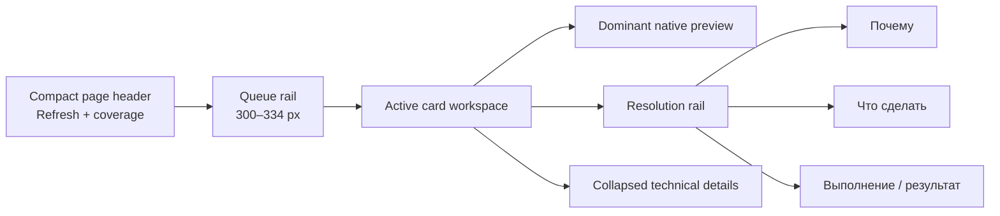
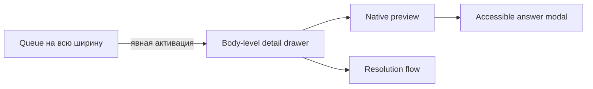
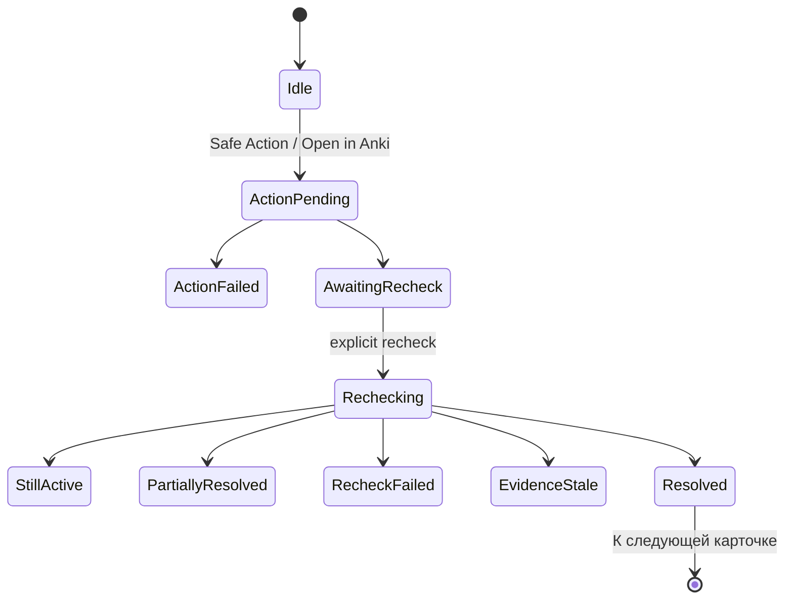

# Cards workspace по Prototype v3.2.3

**Статус:** актуальный production UI contract для `#/cards` в draft PR #130
**Снимок:** 2026-07-26
**Initial Stage 2 implementation:** `1f78b69574794c67149796343dde8cbdd4948fb4`
**Bounded visual revision:** `34a7680392ee7e17dc3ee826dad5bdf9808bc3d1`
**Native Anki night-mode correction:** `f288595499904eadeb81c4ceab3da232581c30f5`
**Native template CSS fidelity repair:** `adfe628e45d8aac59df26f6a4e19b8e45c0cf5d5`
**Owner visual acceptance:** pending
**Profiles coverage:** screenshot-first comparison capture complete; owner review and implementation not started
**Следующий этап:** owner review Cards; Profiles production changes не начинаются автоматически

## Назначение

Этот документ фиксирует перенос принятого standalone Prototype v3.2.3 в настоящую React/TypeScript production-композицию `#/cards`.

Он описывает:

- фактическую visual hierarchy страницы;
- wide desktop и 1024 drawer composition;
- порядок queue → preview → resolution;
- проекции action/recheck/refresh/resolved;
- focus, modal, drawer и reduced-motion contracts;
- границы, которые не менялись при visual recomposition.

API, detector и security contracts остаются в профильных документах:

- [Cards attention inbox](cards-attention-inbox.md);
- [Canonical single-card resolution loop](cards-v2-resolution-loop.md);
- [Card preview semantics](card-preview-semantics.md);
- [Triage read API](cards-v2-triage-read-api.md);
- [Security and safety](security-and-safety.md).

При конфликте старого описания C1.5/C1.6 layout с этим документом current production code/tests и этот composition contract имеют приоритет. Исторические решения не переписываются задним числом.

## 1. Пользовательская задача

`#/cards` — bounded attention workspace, а не общая таблица, редактор или карточный browser.

Пользователь должен:

1. быстро увидеть компактную очередь проблем;
2. выбрать одну карточку;
3. распознать карточку по нативному preview;
4. понять причину и рекомендуемое действие;
5. выполнить существующий safe path;
6. увидеть локальный результат и запустить authoritative recheck;
7. после подтверждённого устранения перейти к следующей карточке.

Каждая область страницы обязана обслуживать один из этих шагов. Техническая диагностика остаётся свёрнутой.

## 2. Каноническая композиция

### Wide desktop: `>= 1200 CSS px`



Фактическая top-level сетка:

```text
compact queue rail | active card workspace
```

Внутри active workspace:

```text
native front preview | resolution rail
```

Production geometry:

- page width: `min(100%, 1800px)`;
- queue rail: `clamp(300px, 23vw, 334px)`;
- active workspace: оставшаяся ширина;
- preview/rail: `minmax(620px, 2.2fr) minmax(286px, 1fr)`;
- при 1200–1500 px preview/rail сжимаются до `minmax(520px, 2fr) minmax(270px, 1fr)`.

Дополнительная ширина используется preview, а не декоративными outer margins или повторяющимися panels.

### Narrow desktop: `< 1200 CSS px`



Drawer:

- один `aside`/`region`, не modal dialog;
- без backdrop, `aria-modal`, `inert` и focus trap;
- queue остаётся видимой и доступной;
- имеет собственный vertical scroll;
- `Escape` и close control закрывают drawer;
- focus возвращается activator либо queue heading;
- активация другой строки обновляет тот же drawer;
- при `1024×768` primary CTA и safe alternatives для single-reason anchor доступны в первом viewport.

Единственным modal остаётся expanded answer через существующий `AccessibleModal`.

## 3. Header и coverage

Header содержит:

- короткий page title;
- bounded description;
- один shared `RefreshButton`;
- одно disclosure покрытия.

Coverage не занимает постоянную vertical wall. Нативный `details` раскрывает:

- learning candidates;
- content candidates;
- Inspection Profiles authority;
- Signals;
- количество проверенных notes.

Refresh независим от mutation lifecycle:

- пригодная queue остаётся видимой;
- region получает busy projection;
- pending не меняет размер control;
- success и failure показываются локально;
- stale usable data не уничтожается при ошибке;
- reduced motion отключает вращение, но не скрывает progress state.

## 4. Queue rail

Queue остаётся семантическим `<ol>`. На строку приходится одна нативная кнопка и одна Tab-stop.

### Header queue

Постоянно видимы:

- название очереди;
- active count;
- локальный text search;
- compact filter toggle.

Priority/reason/deck/period controls находятся в disclosure, а не в permanent filter wall. Активные фильтры отображаются компактными chips с отдельным clear action.

### Row anatomy

```text
priority marker + position
compact card identity
primary reason + N additional reasons
bounded evidence
compact metadata
active/resolved state
```

Строка не содержит:

- preview HTML;
- media reads;
- nested actions;
- checkbox;
- raw IDs и reason codes;
- arbitrary backend search.

Фокус и active selection независимы. Wide mode может выбрать первый inspectable item без перемещения keyboard focus.

## 5. Active card workspace

### Identity header

Header одной карточки содержит:

- lifecycle/state marker;
- compact display identity;
- deck, note type, template и card state;
- categorical priority либо resolved badge.

Здесь нет второго административного summary panel.

### Dominant native preview

Front preview — главная визуальная область. Он использует существующий `AnkiCardShadowPreview`:

- sanitized native front HTML;
- parser-backed safe CSS;
- Shadow DOM isolation;
- trusted local media route;
- native light/dark card context;
- bounded explicit Java highlighting;
- один active preview host.

Ответ/back не дублируется в основном workspace. Кнопка expand открывает существующий accessible modal и использует уже полученный inspect payload.

### Resolution rail

Порядок фиксирован:

```text
Почему
→ Что сделать
→ Выполнение / результат
```

Rail содержит все canonical reasons, bounded evidence, recommendation, один primary path и применимые safe alternatives.

Primary path:

- Open in Anki для edit/handoff;
- authoritative recheck после action/handoff;
- `К следующей карточке` только после server-confirmed `resolved`.

Safe actions не становятся вторым главным workflow. Переход к Inspection Profiles показывается только для content reasons.

Technical details остаются отдельным collapsed disclosure после основного workspace.

## 6. Канонический lifecycle



Canonical authority не менялась:

- success action и `action.no_changes` не означают resolution;
- только `/api/triage/recheck` может подтвердить отсутствие причин;
- stale, partial и unavailable sources fail closed;
- reconciliation использует стабильные `reasonId`.

### Transient resolved projection

Authoritative recheck без активных причин не удаляет DOM row немедленно.

Та же canonical entity остаётся как transient success projection:

- phase = `resolved`;
- active reasons не отображаются;
- categorical priority заменяется resolved state;
- строка исключается из active count;
- action alternatives блокируются;
- доступно одно подтверждающее действие `К следующей карточке`.

Это действие не решает проблему вручную. Resolution уже подтверждён сервером; control только закрывает success projection и переводит пользователя дальше.

После `К следующей карточке`:

1. resolved row удаляется из локальной queue projection;
2. focus получает следующий item в той же позиции;
3. иначе предыдущий item;
4. иначе queue heading.

## 7. State completeness

Stage 2 production composition обязана иметь отдельные, не противоречащие друг другу projections:

| Группа | Состояния |
| --- | --- |
| Query | loading, ready, error, unavailable, partial, empty, filtered empty |
| Inspect | idle, loading, ready, error, stale/missing entity |
| Refresh | idle, pending, success, failure with stale queue |
| Action | idle, pending, success/no-changes, failure |
| Recheck | awaiting, pending, still active, partially resolved, failure, stale, missing/changed entity, resolved |
| Continuation | idle, loading, error, exhausted, capped |
| Responsive | wide workspace, narrow non-modal drawer, expanded answer modal |

State copy имеет RU/EN parity и объявляется через bounded live regions. Несколько одновременно видимых success/error banners не должны дублировать одно состояние.

## 8. Accessibility

- semantic ordered list и native buttons;
- без `grid`, `listbox`, roving tabindex и keyboard model со стрелками;
- visible focus;
- `aria-current` для active item;
- `aria-controls` для detail region;
- `aria-expanded` только в drawer mode;
- polite atomic live state для lifecycle;
- `aria-busy` на подходящей region;
- drawer без focus trap;
- deterministic focus restoration;
- modal answer сохраняет focus trap/portal/inert contract;
- motion отключается или упрощается через `prefers-reduced-motion`.

## 9. Verification и evidence

Текущий production source после native Anki night-mode correction: `f288595499904eadeb81c4ceab3da232581c30f5`.

```text
focused Python card CSS policy: PASS — 27 tests
TypeScript typecheck: PASS
focused Vitest: PASS — 10 files / 61 tests
Vite production build: PASS — 2281 modules
bundle guard: PASS — 21 JavaScript chunks
entry: 437115 bytes
total JavaScript: 1411332 bytes
gzip: 399170 bytes
git diff --check: PASS
Cards CSS context-aware duplicate selectors: 0
```

Focused tests дополнительно закрепляют:

- отсутствие лишнего page eyebrow;
- три последовательные resolution surfaces;
- recommendation-aware primary action для suspended, buried, ordinary, content/profile и multiple-reason cases;
- transient resolved skeleton и единственный primary `К следующей карточке`;
- подписанную кнопку закрытия drawer;
- non-modal drawer focus/Escape contract;
- explicit `light=false` / `dark=true` night-mode propagation;
- одинаковый context для wide, drawer и expanded answer;
- live `light → dark → light` без нового inspect request и без сброса локального Cards state;
- `.card.nightMode` и `.nightMode .child` через parser-backed scoped CSS;
- RU/EN resource parity.

Production visual evidence построено на:

- настоящем Vite production build;
- настоящем React route `#/cards`;
- serialized report/search payload из существующего real-deck E2E artifact;
- media из committed APKG fixtures;
- Chromium `144.0.7559.96`, Debian 13, Node `22.16.0`, DSF 1;
- `1440×900` и `1024×768`;
- RU, light/dark.

Revision evidence identity:

```text
name: cards-v323-production-revision-evidence.zip
files: 88
size: 14390374 bytes
SHA-256: 7974e5b38d2003acc7e606845e1659d819eac593b9be894c8cec5611b751921c
```

Измеренная 1440 geometry:

```text
page usable width: 1380 px
queue: 331 px
workspace: 1034 px
preview: 700 px / 67.7%
resolution rail: 332 px / 32.1%
right unused gutter: 30 px
```

При `1024×768` drawer имеет ширину `737 px`, остаётся немодальной `region` без backdrop и показывает primary CTA в первом viewport.

Подробности, screenshot matrix, known differences и pixel diagnostics находятся в [Stage 2 integration report](../reports/core/c2-cards-v323-production-integration.md).

Generated screenshots, comparisons и capture-only payloads не коммитятся. Evidence package поставляется отдельно от Git tree и package add-on.

## Native Anki night-mode correction

Критическое ревью предыдущего revision evidence выявило функциональный blocker: тёмная тема dashboard не передавала Anki night-mode context внутрь native preview. Внешний shell был тёмным, но карточка оставалась в day context.

Исправленный contract:

```text
AppLayout — единственный owner resolvedTheme
→ ResolvedThemeProvider
→ CardsPage
→ CardsDetail / drawer / expanded answer
→ AnkiCardShadowPreview nightMode
```

При `dark` класс `nightMode` находится на Shadow DOM shell и card root. Parser-backed sanitizer сохраняет scoped семантику обоих официальных шаблонных паттернов:

```css
.card.nightMode { ... }
.nightMode .child { ... }
```

Template CSS остаётся владельцем фактического фона и цветов. Dashboard не красит native card hardcoded значением, не добавляет post-template `!important` override и не ослабляет sanitizer, media validation или action allowlists.

Browser evidence подтвердило:

- Grammar: `rgb(252, 252, 252)` в day context → `rgb(47, 47, 49)` в night context;
- Words: `rgb(252, 252, 252)` → `rgb(47, 47, 49)`;
- Java: template-owned `rgb(43, 43, 43)` в обоих contexts, поскольку этот note type не задаёт отдельный night selector;
- wide, drawer и expanded answer используют один context source;
- inspect request count при `light → dark → light` не изменился: `3 → 3`;
- page errors и console errors отсутствовали.

Correction evidence identity:

```text
name: cards-v323-production-night-mode-correction-evidence.zip
files: 48
size: 5112078 bytes
SHA-256: 13cc34c325d74f4e3f5dd551240a74d64b875687410dda4ce983f1e61882d195
production SHA: f288595499904eadeb81c4ceab3da232581c30f5
```

Artifact содержит same-card light/dark pairs для Grammar, Words и Java, wide/drawer/modal captures, live theme-switch triptych, semantic JSON с class lists/computed styles/preview scale/request counts, neutral known-differences ledger и per-file SHA-256 manifest.

Этот corrective pass не объявляет owner acceptance и не запускает Inspection Profiles.

## Final native preview and visual closure

Последний bounded corrective pass не менял JSX architecture, Cards state/API или night-mode propagation. Он закрыл оставшиеся presentation contracts:

- compact Shadow preview получил равномерный `10 px` outer gap и full-height template-owned native canvas без верхней dashboard-полосы;
- width-fit учитывает horizontal padding; short content растягивает canvas, но не glyphs; long content остаётся bounded/clipped;
- default unstyled card использует безопасный Anki light/dark fallback до template CSS;
- canonical root default font нормализуется в `Arial, "Noto Sans JP", sans-serif`, custom/template/child/code fonts сохраняются;
- queue оформлена как единый component; search и Filters имеют одинаковую высоту; chips, selected, focus и busy projections различимы;
- available primary action использует явную accent hierarchy, secondary и disabled states не конкурируют с ней;
- rail остаётся в порядке `Почему → Что сделать → Выполнение / результат`, но с меньшей border/copy density.

Browser evidence:

```text
wide short-card max gap delta: 0.25 px
default light background: rgb(255, 255, 255)
default dark background: rgb(17, 24, 39)
default computed font: Arial, "Noto Sans JP", sans-serif
Java code font: Consolas, "JetBrains Mono", "Courier New", monospace
long fixture overflow: true
page errors: 0
unexpected console errors: 0
```

Final evidence identity:

```text
name: cards-v323-production-final-visual-closure-evidence.zip
files: 111
size: 7311471 bytes
SHA-256: 6feef7766f9283316199430da3dc934b8ab91c5808bf6fe4ae7c589c8dd2599b
production SHA: c2c2b65b399907010ff7e2d40307b1ded02a1bc3
manifest content files: 109
SHA256SUMS entries: 110
self-verification: PASS
```

`manifest.json` hashes content files, но не себя и не `SHA256SUMS`; `SHA256SUMS` hashes manifest и content files, но не себя. Проверка выполнена после распаковки ZIP в пустой каталог. Owner acceptance остаётся pending.

## 10. Границы Stage 2

Не менялись:

- backend/API/schema;
- detector semantics;
- direct collection boundary;
- loopback/token contract;
- CSP/media validation и security allowlists;
- backend/API/schema;
- action allowlists;
- iframe/JavaScript policy;
- Inspection Profiles UI;
- App Shell других routes.

Не выполнялись:

- Fast CI;
- package-producing gate;
- Docker/real-Anki E2E;
- private-profile owner acceptance;
- Inspection Profiles 1:1;
- merge PR #130;
- release или C3.

## 11. Owner checkpoint

Текущий статус:

```text
Stage 2 composition: COMPLETE
bounded visual revision: COMPLETE
native Anki night-mode correction: COMPLETE
final native preview and visual closure: COMPLETE
native template CSS fidelity repair/evidence: COMPLETE
Cards visual parity closure: COMPLETE
Cards owner visual acceptance: PENDING
Inspection Profiles corrected screenshot-first audit: COMPLETE / OWNER TARGET DECISION PENDING
Inspection Profiles 1:1 implementation: NOT STARTED
final integration: NOT RUN
PR #130: OPEN / DRAFT / UNMERGED
```

Допустимые решения владельца:

```text
ACCEPT CARDS 1:1
```

или:

```text
REVISE:
<конкретные visual/interaction deviations>
```


## Native Anki stylesheet regression after final visual closure

Timeline:

```text
f288595 → template-owned Words background/night/accent styles confirmed
c2c2b65 → canvas geometry improved, but report CSS was cut at 3000 chars and preview fallback overrode root typography
0093237 → media/lifecycle evidence repaired; CSS regression remained
adfe628 → complete bounded sanitizer output restored and fallback specificity weakened
```

Exact same-card browser provenance uses committed `words-n1.apkg`, card `1649481469689`, note type `Слова`, ordinal `0`, template `Карточка 1`. Raw CSS, sanitized CSS, inspect/report payload and Shadow DOM style order are hashed in the evidence package.

Visual comparison coverage also uses the exact Prototype card identities for Japanese Words (`1708095865696`, `工作`), Japanese Grammar (`1781457470336`) and Java (`1780002619582`, deep copy), with Prototype/Production side-by-side sheets in light/dark. All named Prototype Inspection Profiles / Settings contours were captured under the same state names for screenshot-first comparison; this is evidence collection only, not Profiles acceptance or implementation.


## Cards visual parity closure after independent review

Independent review accepted the repaired native template CSS path but found that the compact card was still scaled below the accepted reference and that drawer/modal evidence had been captured as isolated layers rather than as complete pages.

The bounded correction at production commit `ce45194e659aeba43f05a2b13cbf6f0583e601aa` changes only Cards presentation:

- compact preview base width is `660px`, producing approximately `0.983×` in the measured wide frame and `1×` in drawer/modal where width permits;
- the `1024×768` drawer is evidenced as a complete viewport with the queue still visible and usable;
- expanded answer uses the accepted `1040px` bounded modal width and `calc(100dvh - 112px)` height contract;
- the redundant footer close action is removed; header close and Escape remain;
- sanitizer, payload CSS, backend APIs, card template CSS and Profiles production code are unchanged.

The primary evidence is `cards-visual-parity-and-profiles-audit-evidence.zip`, SHA-256 `e2c1d35bb12088ad0d285371514789637be60025050f5a8ded6307048c6dd2da`. It uses the exact Prototype card identities for Words (`1708095865696`), Grammar (`1781457470336`) and Java (`1780002619582`) and compares full pages rather than differently cropped layers.

Cards owner acceptance is still not self-issued by this contract.
