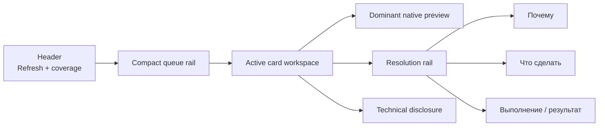

# C2 / PR #130 — Cards Prototype v3.2.3 production integration

**Дата:** 2026-07-26
**Репозиторий:** `AliceLiddell01/anki-study-report`
**Base branch:** `core`
**Frozen base SHA:** `62cd4c1fc1dda6354f3e30cb3ae4aee5dfb4891f`
**Working branch:** `c2-manual-acceptance-remediation`
**Stage 2 start SHA:** `c6afac028e5cbf9ac6ffc1923862c71afb731798`
**Transport commit:** `b6ebbe7feff909644d81aa607867115cf264a340`
**Production implementation commit:** `1f78b69574794c67149796343dde8cbdd4948fb4`
**Documentation sequence correction:** `ace37c3caa67c97e7a70b4ac499ba39b05e4e695`
**Bounded visual revision start:** `94ba28dc8cf414fcade1eb2041b548022dc3836e`
**Production visual revision:** `34a7680392ee7e17dc3ee826dad5bdf9808bc3d1`
**Native Anki night-mode correction:** `f288595499904eadeb81c4ceab3da232581c30f5`
**Native template CSS fidelity repair:** `adfe628e45d8aac59df26f6a4e19b8e45c0cf5d5`
**Pull request:** `#130` — OPEN / DRAFT / UNMERGED
**Статус:** native template CSS fidelity repair и exact same-card evidence завершены; Cards owner acceptance отозван и снова ожидает решения; Profiles screenshot-first captures собраны, но owner review/implementation не выполнялись.

## 1. Краткий результат

Stage 2 перенёс принятую композицию standalone Prototype v3.2.3 в настоящий production route `#/cards` без возвращения отклонённого global CSS overlay.

Результат:

```text
source guard                              PASS
live PR/base/head guard                   PASS
real React composition                    COMPLETE
wide Cards workspace                      COMPLETE
1024 non-modal drawer                     COMPLETE
native front/back preview                 PRESERVED
safe action/recheck lifecycle             PRESERVED
transient resolved projection             COMPLETE
RU/EN resource parity                     PASS
focused tests/typecheck/build              PASS
production visual evidence                COMPLETE
bounded visual revision                   COMPLETE
revision visual evidence                  COMPLETE
native Anki night-mode correction         COMPLETE
night-mode semantic/visual evidence       COMPLETE
native template CSS fidelity repair       COMPLETE
Cards owner acceptance                    REVOKED / PENDING
Profiles screenshot-first capture         COMPLETE
Profiles owner review / implementation     NOT PERFORMED / NOT STARTED
Fast CI / Docker / final integration gate NOT RUN
merge / release / C3                      NOT PERFORMED
```

## 2. Почему потребовался отдельный Stage 2

Предыдущий C2 closeout доказал latest-Core synchronization, удаление rejected overlay, telemetry repair, exact package и real-Anki E2E для production candidate `a746172f8746eac82ff628d36a7a6328d9332acf`.

Однако удаление overlay не являлось 1:1 переносом принятого Prototype v3.2.3. После Stage 1 оставалась отдельная задача:

- не накладывать prototype CSS поверх старой композиции;
- перестроить настоящий component tree Cards;
- сохранить канонические API/state/security contracts;
- повторно собрать visual evidence уже для production React route;
- остановиться на owner checkpoint до Inspection Profiles.

Поэтому historical Stage 1 package/E2E evidence не выдаётся за доказательство новой Stage 2 composition.

## 3. Source guard

Перед implementation были открыты и сверены:

- `README.md` и `docs/ai-handoff.md`;
- текущий `roadmap/core/README.md`;
- профильные Cards, preview, accessibility, test и security contracts;
- current production code и tests;
- independent UI review;
- accepted Prototype v3.2.3 package;
- `prototype.html`, state, interaction, accessibility и motion reports;
- real-deck E2E foundation closeout;
- real-deck E2E artifact;
- текущий PR #130 и его live state.

Live guard на момент Stage 2 start:

```text
PR #130: OPEN / DRAFT / UNMERGED
base: core
base SHA: 62cd4c1fc1dda6354f3e30cb3ae4aee5dfb4891f
head: c6afac028e5cbf9ac6ffc1923862c71afb731798
relation to core: ahead / behind 0
```

## 4. Scope

### В scope

- real JSX/component recomposition `#/cards`;
- compact header, Refresh и coverage disclosure;
- compact queue rail;
- dominant native front preview;
- separate resolution rail;
- one shared `CardsDetail` implementation для wide/drawer;
- 1024 body-level non-modal drawer;
- expanded native answer modal;
- coherent action/recheck/refresh/resolved states;
- transient resolved projection и deterministic focus transfer;
- RU/EN copy для новой composition;
- focused tests, typecheck, build и visual evidence;
- current docs, roadmap, handoff и reports.

### Вне scope

- backend/API/schema;
- detector logic;
- Inspection Profiles 1:1;
- App Shell других страниц;
- C3;
- full CI/package/Docker campaign;
- private Anki profile;
- merge PR #130;
- release/deployment/publication.

## 5. Архитектурное решение

### 5.1. До Stage 2

Широкий Cards layout был ориентирован на большую filters/control surface и отдельный Inspector. Дополнительная ширина недостаточно усиливала preview; action/recheck content конкурировал с identity и reasons.

### 5.2. После Stage 2



На `< 1200 px` active workspace переносится в body-level drawer; queue остаётся доступной.

### 5.3. Сохранённые boundaries

- `useCardsTriageWorkspace` остаётся единственным state owner;
- query/inspect/recheck используют existing APIs;
- reads сохраняют latest-wins и sequence guards;
- inspect cache остаётся bounded и generation-aware;
- native preview остаётся Shadow DOM surface;
- sanitizer, safe CSS, local media validation и CSP не ослаблены;
- Java highlighting остаётся bounded и explicit;
- frontend не читает collection напрямую;
- safe actions не расширены.

## 6. Изменения production code

| Файл | Изменение |
| --- | --- |
| `web-dashboard/src/pages/CardsPage.tsx` | новая page/header/queue/workspace composition, filter disclosure, active count, drawer host |
| `web-dashboard/src/components/cards/CardsInbox.tsx` | компактная row anatomy и resolved projection |
| `web-dashboard/src/components/cards/CardsDetail.tsx` | dominant preview, resolution rail, result projections, next-card acknowledgement |
| `web-dashboard/src/hooks/useCardsTriageWorkspace.ts` | transient resolved entity и `advanceResolved()` с focus transfer |
| `web-dashboard/src/styles/cardsInbox.css` | принятая geometry, surfaces, drawer, state/motion/reduced-motion presentation |
| `web-dashboard/src/i18n/cardsWorkspaceV323.ts` | bounded RU/EN copy override для Stage 2 composition |
| `web-dashboard/src/i18n/index.ts` | merge current locale resources с v3.2.3 workspace copy |
| профильные tests | новая composition, lifecycle, focus и localization parity |

Backend, Python runtime и package schema не изменялись.

## 7. Resolved lifecycle

### 7.1. Authority

Resolution по-прежнему определяется только authoritative exact-card recheck.

```text
action/open
→ awaiting recheck
→ explicit recheck
→ still active | partially resolved | failed/stale | resolved
```

### 7.2. Почему row не удаляется сразу

Немедленное исчезновение после recheck лишало пользователя локального подтверждения, что именно произошло, и делало focus transition визуально резким.

Stage 2 сохраняет ту же canonical entity как transient success projection:

- active reasons отсутствуют;
- priority заменён resolved state;
- row исключён из active count;
- доступен единственный primary control `К следующей карточке`.

Этот control не является manual Resolve. Server уже подтвердил отсутствие причин. Control только закрывает success feedback и переводит пользователя дальше.

### 7.3. Focus

После acknowledgement:

1. следующий item в той же queue position;
2. предыдущий item;
3. queue heading, если queue пуста.

Focused hook test подтверждает эту последовательность.

## 8. Accessibility и interaction

Подтверждены:

- ordered list и native button на row;
- одна Tab-stop на item;
- visible focus и `aria-current`;
- drawer `role=region`, не dialog;
- отсутствие backdrop, inert и focus trap у drawer;
- Escape close и focus restoration;
- modal answer использует existing portal/focus trap;
- polite live status lifecycle;
- busy semantics для refresh/action/recheck;
- reduced-motion path;
- RU/EN parity.

## 9. Focused verification

Локальный runnable checkout был собран из branch source и pnpm 9.15.9 dependencies.

| Проверка | Результат |
| --- | --- |
| TypeScript `tsc --noEmit` | PASS |
| Focused Vitest | PASS — 7 files / 34 tests |
| Vite production build | PASS — 2279 modules transformed |
| Bundle guard | PASS — 21 JavaScript chunks |
| `git diff --check` | PASS |

Focused test set:

```text
src/i18n/resources.test.ts
src/pages/CardsPage.test.tsx
src/hooks/useCardsTriageWorkspace.test.tsx
src/components/AnkiCardShadowPreview.test.tsx
src/components/AnkiCardShadowPreviewHighlighting.test.tsx
src/lib/cardCodeHighlighting.test.ts
src/components/cards/CardsDetailDrawer.test.tsx
```

Bundle diagnostics:

```text
entry: 436151 bytes
total JavaScript: 1409011 bytes
gzip: 398610 bytes
```

## 10. Production visual evidence

### 10.1. Identity

Evidence package:

```text
name: cards-v323-production-evidence.zip
files: 88
size: approximately 16 MiB
SHA-256: c469c4b6addb7e34beca393d13126b97ef413fd4906c85b4bb548d4f98bd6139
```

Capture contour:

- actual Vite production build;
- actual React `#/cards` route;
- exact serialized report/search-preview payload из existing real-deck E2E artifact;
- media extracted from committed APKG fixtures;
- intercepted validated `/api/media` responses;
- Chromium, device scale factor 1;
- `1440×900` и `1024×768`.

### 10.2. Screenshot matrix

| Группа | Production files |
| --- | --- |
| Main | `production/cards-1440-dark-main.png`, `production/cards-1440-light-main.png` |
| Words | `production/words-1440-dark.png`, `production/words-1440-light.png` |
| Grammar | `production/grammar-1440-dark.png`, `production/grammar-1440-light.png` |
| Java | `production/java-1440-dark.png`, `production/java-1440-light.png` |
| 1024 drawer | `production/cards-1024-dark-drawer-cta.png`, `production/cards-1024-light-drawer-cta.png` |
| Action | `production/cards-1440-dark-action-pending.png`, light/dark failure captures |
| Recheck | awaiting, pending, failed, still-active captures |
| Refresh | pending, success и failure captures |
| Resolved | `production/cards-1440-dark-resolved.png` |
| Modal | `production/cards-1440-dark-expanded-answer.png` |
| Multiple reasons | main real-deck anchor с тремя canonical reasons |

### 10.3. Comparison package

Для ключевых contours включены:

```text
prototype reference
production screenshot
side-by-side
50% alpha overlay
amplified absolute pixel diff
```

Compared contours:

- `main-dark`;
- `drawer-1024-light`;
- `awaiting-recheck-dark`;
- `recheck-pending-dark`;
- `still-active-dark`;
- `resolved-dark`;
- `action-failure-light`;
- `recheck-failed-light`;
- `refresh-pending-light`;
- `refresh-failure-light`;
- `refresh-success-light`.

### 10.4. Pixel diagnostics

Pixel diff используется только как diagnostic, не как pass/fail threshold: prototype и production используют разные real content, counts и текущий App Shell.

| Contour | Size | Mean absolute RGB difference |
| --- | ---: | ---: |
| `main-dark` | 1440×900 | 44.37 |
| `drawer-1024-light` | 1024×768 | 18.61 |
| `awaiting-recheck-dark` | 1440×900 | 45.79 |
| `recheck-pending-dark` | 1440×900 | 44.63 |
| `still-active-dark` | 1440×900 | 48.07 |
| `resolved-dark` | 1440×962 | 44.51 |
| `action-failure-light` | 1440×900 | 14.73 |
| `recheck-failed-light` | 1440×900 | 14.98 |
| `refresh-pending-light` | 1440×962 | 14.62 |
| `refresh-failure-light` | 1440×962 | 15.45 |
| `refresh-success-light` | 1440×900 | 14.94 |

### 10.5. Known differences

Accepted/bounded:

- current production App Shell вместо standalone prototype shell;
- real-deck identities/content вместо demo data;
- production main anchor содержит три canonical reasons;
- single-reason real-deck anchor используется для first-viewport 1024 CTA contour;
- Chromium fonts, native controls, scrollbars и antialiasing отличаются;
- dynamic counts отражают пять selected real-deck anchors, а не prototype demo rows.

Не считаются допустимыми различиями:

- другой region order;
- широкая queue вместо compact rail;
- потеря preview dominance;
- перенос resolution rail;
- modal drawer вместо non-modal region;
- немедленное исчезновение resolved row;
- отсутствующие controls;
- permanent filter wall.

### 10.6. Почему PNG не находятся в Git tree

Project hygiene запрещает коммитить generated screenshots, comparisons, E2E outputs и capture-only payloads. Поэтому report хранит identity, hash, matrix и known differences, а бинарное evidence поставляется отдельно.

Ни screenshots, ни ZIP не входят в `.ankiaddon` package.

## 11. Bounded visual revision pass

### 11.1. Identity и границы

```text
revision start SHA: 94ba28dc8cf414fcade1eb2041b548022dc3836e
production revision SHA: 34a7680392ee7e17dc3ee826dad5bdf9808bc3d1
branch: c2-manual-acceptance-remediation
PR #130: OPEN / DRAFT / UNMERGED
backend/API/schema: unchanged
Inspection Profiles: untouched
```

Это один ограниченный visual revision pass, а не новый numbered stage. Он не повторял Stage 1, не создавал Stage 2.1 и не запускал final integration campaign.

### 11.2. Исправленные deviations

| Область | Результат |
| --- | --- |
| Width utilization | удалён произвольный правый gutter; Cards использует допустимую ширину current shell |
| Queue/workspace | queue сохранена компактной; оставшаяся ширина передана active workspace |
| Preview/rail ratio | preview `700 px / 67.7%`, rail `332 px / 32.1%` |
| UI scale | увеличены реальные typography, controls, paddings, gaps и surface geometry без `transform: scale()` |
| Resolution hierarchy | `Почему`, `Что сделать`, `Выполнение/Результат` оформлены как три отдельные bounded surfaces |
| Active header | увеличена высота, identity/status/metadata читаемы, badge связан с header |
| Page header | удалён лишний eyebrow `Очередь внимания` |
| Queue | синхронизированы header, count, controls, row height, typography и selected state |
| Drawer | заметная `Закрыть ×`, non-modal semantics, правильный internal scroll и CTA в первом `1024×768` viewport |
| Resolved | сохранён skeleton из трёх surfaces; активные причины/priority не возвращаются |
| State panels | pending/error/success состояния получили bounded panel hierarchy |
| Primary action | canonical safe action становится primary, когда прямо соответствует recommendation; Open in Anki остаётся primary только для соответствующего пути |

State ownership, API, authoritative recheck, Shadow DOM preview, sanitizer, media validation, action allowlists и focus contracts не изменялись.

### 11.3. Focused verification после последней correction

| Проверка | Результат |
| --- | --- |
| TypeScript `tsc --noEmit` | PASS |
| Focused Vitest | PASS — 10 files / 43 tests |
| Vite production build | PASS — 2280 modules transformed |
| Bundle guard | PASS — 21 JavaScript chunks |
| `git diff --check` | PASS |

Focused set:

```text
src/i18n/resources.test.ts
src/pages/CardsPage.test.tsx
src/pages/CardsVisualContract.test.ts
src/hooks/useCardsTriageWorkspace.test.tsx
src/components/cards/CardsInbox.test.tsx
src/components/cards/CardsDetailDrawer.test.tsx
src/components/AnkiCardShadowPreview.test.tsx
src/components/AnkiCardShadowPreviewHighlighting.test.tsx
src/lib/cardCodeHighlighting.test.ts
src/lib/triagePresentation.test.ts
```

Bundle diagnostics:

```text
entry: 436925 bytes
total JavaScript: 1411062 bytes
gzip: 399064 bytes
```

### 11.4. Geometry

Prototype values ниже получены из accepted rasters и являются approximate; production values измерены из browser layout.

| Метрика | Prototype | Production revision |
| --- | ---: | ---: |
| page usable width | ~1388 px | 1380 px |
| queue width | ~331 px | 331 px |
| workspace width | ~1039 px | 1034 px |
| preview width | ~714 px | 700 px |
| resolution rail | ~325 px | 332 px |
| preview share | ~68.7% | 67.7% |
| rail share | ~31.3% | 32.1% |
| right unused gutter | ~26 px | 30 px |
| active header height | ~90 px | 98 px |
| queue row height | ~60 px | 70 px |

`1024×768`:

```text
drawer x: 287 px
drawer width: 737 px
drawer height: 696 px
backdrop: false
primary CTA visible in first viewport: true
```

### 11.5. Revision evidence

```text
name: cards-v323-production-revision-evidence.zip
files: 88
size: 14390374 bytes
SHA-256: 7974e5b38d2003acc7e606845e1659d819eac593b9be894c8cec5611b751921c
```

Capture environment:

```text
production SHA: 34a7680392ee7e17dc3ee826dad5bdf9808bc3d1
Chromium: 144.0.7559.96
OS: Debian GNU/Linux 13
Node: 22.16.0
device scale factor: 1
viewports: 1440×900, 1024×768
locale: RU
themes: light, dark
payload: serialized real-deck E2E API report
media: committed real-deck APKG fixtures decoded locally
```

Critical comparisons:

```text
main-dark
main-light
drawer-1024-light
drawer-1024-dark
resolved-dark
awaiting-recheck-dark
recheck-pending-dark
still-active-dark
action-failure-light
recheck-failed-light
refresh-pending-light
refresh-success-light
refresh-failure-light
```

Package содержит `manifest.json`, references, production captures, side-by-side, 50% overlays, amplified diffs, contact sheet, metrics и known differences.

Accepted remaining differences:

- current App Shell;
- реальные identities/content/counts;
- native controls, scrollbar и font raster;
- bounded height variation от real content;
- drawer width, согласованная с current shell.

### 11.6. Publication note

Verified patch применён commit `34a7680392ee7e17dc3ee826dad5bdf9808bc3d1` через checksum-guarded transport и `git apply --index --whitespace=error`. Временный workflow и patch chunks удалены тем же production commit. Первый transport attempt остановился до `git apply` из-за несовпадения длинного connector blob; production source при этом не менялся. После разбиения на проверенные chunks повтор завершился успешно.

Owner acceptance этим revision pass не объявляется.

## Native Anki night-mode correction

### Причина

Критическое owner review предыдущего revision artifact вынесло решение `REVISE`: тёмная тема dashboard не активировала native Anki night-mode context внутри Shadow DOM preview. Wide, drawer и expanded answer отображали day-card на тёмном shell. Это было функциональным blocker, а не допустимой palette difference. Исходное ревью также потребовало исправить tests, evidence, documentation и консолидировать Cards CSS без нового numbered stage.

### Production correction

`AppLayout` остаётся единственным владельцем `resolvedTheme`. Небольшой React context передаёт resolved value вниз, а Cards преобразует его в один explicit boolean:

```text
light → nightMode=false
dark  → nightMode=true
```

Этот boolean проходит через один component path в:

- wide front preview;
- body-level non-modal drawer;
- expanded back/answer modal.

`AnkiCardShadowPreview` добавляет `nightMode` на Shadow DOM shell и native card root. Dashboard не читает theme случайно из global DOM, не refetch-ит inspect payload и не задаёт hardcoded native-card background.

Parser-backed CSS policy дополнена scoped обработкой обоих Anki night selectors:

```css
.card.nightMode { ... }      → :scope.nightMode { ... }
.nightMode .child { ... }     → :scope.nightMode .child { ... }
```

Allowlist, parser, URL/media validation и запрет внешних execution surfaces не ослаблялись.

### Bounded visual normalization

В том же последнем corrective pass без новой JSX architecture:

- `cardsInbox.css` консолидирован; поздние revision/correction override-блоки удалены;
- context-aware exact duplicate selectors: `0`;
- light page/queue/workspace/preview-frame/rail surfaces разделены только снаружи native card;
- resolution rail уплотнён;
- selected queue row смягчён;
- resolved green локализован около confirmation locus;
- active header собран плотнее;
- primary action mapping доказан для suspended, buried, ordinary, content/profile и multiple-reason contours.

### Focused verification

```text
focused Python card CSS policy: PASS — 27 tests
TypeScript tsc --noEmit: PASS
focused Vitest: PASS — 10 files / 61 tests
Vite production build: PASS — 2281 modules transformed
bundle guard: PASS — 21 JavaScript chunks
entry: 437115 bytes
total JavaScript: 1411332 bytes
gzip: 399170 bytes
git diff --check: PASS
Cards CSS context-aware duplicate selectors: 0
```

Не запускались full Python/frontend suites, Fast CI, package-producing gate, Docker/real-Anki E2E и final integration campaign.

### Semantic browser evidence

Capture использовал production build, serialized real-deck E2E API payload, CSS note types из committed APKG, текущий parser-backed sanitizer и committed media fixtures.

Подтверждено:

| Контур | Day background | Night background | Результат |
| --- | --- | --- | --- |
| Grammar | `rgb(252, 252, 252)` | `rgb(47, 47, 49)` | template night selector applied |
| Words | `rgb(252, 252, 252)` | `rgb(47, 47, 49)` | template night selector applied |
| Java | `rgb(43, 43, 43)` | `rgb(43, 43, 43)` | template-owned dark surface; separate night selector отсутствует |

Дополнительно:

- shell/card class lists содержат `nightMode` только в dark context;
- `.nightMode .child` меняет computed child color;
- wide/drawer/modal используют одинаковый context;
- live `light → dark → light` сохранил selected card и payload;
- inspect requests до/после theme switch: `3 → 3`;
- page errors: `0`;
- console errors: `0`.

### Correction evidence

```text
name: cards-v323-production-night-mode-correction-evidence.zip
files: 48
size: 5112078 bytes
SHA-256: 13cc34c325d74f4e3f5dd551240a74d64b875687410dda4ce983f1e61882d195
production SHA: f288595499904eadeb81c4ceab3da232581c30f5
```

Artifact не перезаписывает предыдущий revision package. Он содержит same-card light/dark pairs для Grammar, Words и Java, drawer и expanded-back pairs, live theme-switch triptych, semantic JSON, computed styles, class lists, preview scale, request counts, neutral known-differences ledger, comparisons, diagnostics, contact sheet и SHA-256 manifest.

Этот блок не выдаёт self-acceptance. Cards owner acceptance остаётся pending.

## Final native preview and visual closure

Финальное owner review подтвердило night-mode architecture, но потребовало один последний visual/canvas/font/evidence pass без нового numbered stage.

### Production correction

- Shadow compact preview учитывает `20 px` total horizontal/vertical padding при width-fit и canvas-height calculation;
- короткий native canvas заполняет inner viewport, сохраняя template background;
- длинный content остаётся width-fitted и clipped; expanded answer — auto-height;
- default night fallback размещён до template CSS с equal specificity, поэтому исправляет unstyled card, но не перебивает custom template;
- root canonical defaults `Arial`, `Arial, sans-serif`, `sans-serif` нормализуются parser-backed в `Arial, "Noto Sans JP", sans-serif`; custom, `@font-face`, child и code fonts не меняются;
- queue/search/Filters/chips, selected/focus/busy и primary/secondary/disabled hierarchy доведены без новой component architecture.

### Verification

```text
focused Python card CSS policy: PASS — 36 tests
TypeScript tsc --noEmit: PASS
focused Vitest: PASS — 9 files / 53 tests
Vite production build: PASS — 2281 modules transformed
bundle guard: PASS — 21 JavaScript chunks
entry: 437115 bytes
total JavaScript: 1412442 bytes
gzip: 399403 bytes
git diff --check: PASS
```

### Browser/evidence results

- same-family Prototype/Production: Grammar, Words, Java — light/dark;
- wide ready, preview closeups, default/long fixtures, queue selected/focus/busy, toolbar/chips, all primary-action mappings, lifecycle matrix, 1024 drawer и expanded answer;
- wide short-card max gap delta: `0.25 px`;
- default unstyled: `rgb(255,255,255)` light → `rgb(17,24,39)` dark;
- computed default font: `Arial, "Noto Sans JP", sans-serif`;
- Java code font preserved: `Consolas, "JetBrains Mono", "Courier New", monospace`;
- page errors: `0`; unexpected console errors: `0`; три HTTP 500 console messages ожидаемы в action/recheck/refresh failure contours.

```text
name: cards-v323-production-final-visual-closure-evidence.zip
files: 111
size: 7311471 bytes
SHA-256: 6feef7766f9283316199430da3dc934b8ab91c5808bf6fe4ae7c589c8dd2599b
production SHA: c2c2b65b399907010ff7e2d40307b1ded02a1bc3
manifest content files: 109
SHA256SUMS entries: 110
self-verification: PASS
```

Integrity проверена после распаковки в пустой каталог: все manifest paths/sizes/hashes совпали, `sha256sum -c SHA256SUMS` завершился успешно. Artifact не коммитится и не входит в `.ankiaddon`. Owner acceptance этим report не объявляется.


## Cards evidence micro-repair and visual coverage checkpoint

Revised owner review обнаружило два дефекта не production composition, а финального evidence package. Этот ненумерованный micro-pass не менял Cards API, lifecycle, JSX/CSS или production SHA.

### Words positive media

Предыдущий capture harness отдавал вместо real-deck media некорректный 14-byte GIF placeholder. Production path уже добавлял dashboard token к разрешённым локальным `/api/media?name=...` URL, поэтому source correction не потребовалась.

Repair capture использовал настоящий `影.gif`, извлечённый из committed `words-n1.apkg`:

```text
cardId: 1649481469689
media: 影.gif
same media in light/dark: true
complete: true
naturalWidth: 160
naturalHeight: 120
local request status: 200
token present: true
external requests: 0
page errors: 0
console errors: 0
```

### Completed still_active

Предыдущий harness ожидал завершение `click()`, но не delayed authoritative recheck response. Поэтому файл `still-active-dark.png` был снят ещё в `rechecking` и совпал с pending capture.

Repaired guard ожидает canonical DOM phase и completed message:

```text
expected phase: still_active
actual phase: still_active
aria-busy: false
visible status: Всё ещё требует внимания
pending status absent: true
completed status present: true
controls available: true
recheck_pending SHA-256: 0b2d572564f0fb65c8d988908efb89fd922ebc434ff1327f68ab1698e6b85bc1
still_active SHA-256: e4bbff63acd2f2cf7464ec370916eb5aa86f22c5ced7051d617a9a382773dfb0
byte-identical: false
```

`awaiting-recheck-*` captures исходного full package могут быть намеренно идентичны: они документируют один общий pre-outcome checkpoint перед разными authoritative results. Эта семантика явно записана в repaired artifact.

### Repaired artifact

```text
name: cards-v323-production-final-evidence-repair.zip
files: 20
size: 659105 bytes
SHA-256: ab2db7135ee3993e0e31668252b814694ae34d8adb1688398d5b3d13747e55d8
production SHA: c2c2b65b399907010ff7e2d40307b1ded02a1bc3
source full artifact: cards-v323-production-final-visual-closure-evidence.zip
source full artifact SHA-256: 6feef7766f9283316199430da3dc934b8ab91c5808bf6fe4ae7c589c8dd2599b
manifest content files: 18
SHA256SUMS entries: 19
self-verification: PASS
```

После распаковки в пустой каталог подтверждены `sha256sum -c SHA256SUMS`, manifest paths/sizes/hashes, `missing=0`, `unexpected=0`, `mismatches=0`.

### Visual coverage ledger

Cards acceptance остаётся route-scoped и не является PR-wide acceptance.

| Route / area | Prototype | Current production | Review | Verdict / next action |
| --- | --- | --- | --- | --- |
| `#/cards` wide | есть | есть, Words media repaired | выполнен | Cards owner decision PENDING |
| `#/cards` drawer/modal | есть | есть | выполнен | входит только в Cards checkpoint |
| `#/cards` lifecycle | есть | repaired completed `still_active` | выполнен | Cards owner decision PENDING |
| `#/settings/inspection-profiles` | есть | актуального полного пакета нет | не выполнен | NOT REVIEWED |
| Settings shared shell | частично | старые CI captures | не выполнен | NOT REVIEWED |
| Other Settings routes | redesign вне scope | нужен regression sweep | не выполнен | OUT OF SCOPE / REGRESSION ONLY |

После команды `ACCEPT CARDS 1:1` следующий шаг — отдельный **Inspection Profiles screenshot-first audit** Prototype v3.2.3 ↔ current production, без production changes на первом проходе. Profiles implementation, shared Settings regression sweep и final PR verification не начаты.

## 12. Git publication

Stage 2 implementation и bounded visual revision опубликованы без force-push:

```text
b6ebbe7feff909644d81aa607867115cf264a340
Stage the verified Cards integration patch

1f78b69574794c67149796343dde8cbdd4948fb4
Recompose the Cards workspace around the accepted prototype

ace37c3caa67c97e7a70b4ac499ba39b05e4e695
Correct the Cards and Profiles integration sequence

34a7680392ee7e17dc3ee826dad5bdf9808bc3d1
Align the Cards workspace with the accepted visual reference

f288595499904eadeb81c4ceab3da232581c30f5
Restore native Anki night-mode fidelity in Cards previews

c2c2b65b399907010ff7e2d40307b1ded02a1bc3
Complete the Cards native preview and visual closure
```

Transport workflow:

- проверил SHA-256 двух prepared patch blocks;
- применил их через `git apply --index --whitespace=error`;
- создал production и documentation commits;
- удалил `.stage2-patch/` и temporary workflow из итогового tree;
- не выполнял force-push.

## 13. Что не проверено

```text
full frontend Vitest: NOT RUN for Stage 2
full Python suite: NOT RUN for Stage 2 (focused card CSS policy: 36 tests PASS)
canonical run_full_check.ps1 -SkipDocker: NOT RUN for Stage 2
Fast CI/package artifact: NOT RUN for Stage 2
Docker/real-Anki E2E: NOT RUN for Stage 2
private-profile owner acceptance: NOT PERFORMED
Inspection Profiles 1:1: NOT STARTED
final integration verification: NOT RUN
```

Предыдущие Stage 1 Fast CI `30173712679` и real-Anki E2E `30174041436` остаются historical baseline для pre-Stage-2 package, но не доказывают новую Cards composition.

## 14. Остаточные риски

- private note types и media могут выявить collection-specific visual issue;
- platform font/scrollbar raster отличается от capture environment;
- very long RU/EN labels требуют owner observation на реальном desktop;
- 1024 drawer wheel/scroll ownership требует private-profile acceptance;
- safe CSS fidelity намеренно ограничена allowlist;
- Stage 2 head не имеет нового exact package/E2E identity;
- owner может потребовать ещё одну конкретную correction только через явный `REVISE`; новый автоматический pass не запускается.

## 15. Документация

Актуальный contract:

- [Cards workspace по Prototype v3.2.3](../../docs/cards-v323-production-workspace.md);
- [Cards attention inbox](../../docs/cards-attention-inbox.md);
- [Canonical resolution loop](../../docs/cards-v2-resolution-loop.md);
- [Card preview semantics](../../docs/card-preview-semantics.md);
- [Frontend map](../../docs/frontend-map.md).

Исторический Stage 1 closeout:

- [C2 post-merge manual acceptance remediation](c2-manual-acceptance-remediation-closeout.md).

## 16. Решение и следующий шаг

```text
Stage 2 composition COMPLETE
bounded visual revision COMPLETE
native Anki night-mode correction COMPLETE
final native preview and visual closure COMPLETE
final visual closure evidence COMPLETE
→ owner checkpoint: ACCEPT CARDS 1:1 или REVISE
→ только после ACCEPT: Stage 3 Inspection Profiles 1:1
→ Profiles owner checkpoint
→ final verification
→ separate merge decision for PR #130
```

PR остаётся OPEN / DRAFT / UNMERGED. C3, release и publication не активируются автоматически.


## Native Anki stylesheet regression after final visual closure

### Timeline and root cause

```text
f288595499904eadeb81c4ceab3da232581c30f5
→ exact Words template background/night/accent rules worked

c2c2b65b399907010ff7e2d40307b1ded02a1bc3
→ `_dashboard_preview_css()` cut the already-sanitized stylesheet to 3000 characters inside a CSS rule; preview typography/spacing fallback also had excessive specificity

0093237d7eb4df1d936125ff88821775737516b0
→ media and still_active evidence repaired, but production CSS regression remained

adfe628e45d8aac59df26f6a4e19b8e45c0cf5d5
→ full parser-bounded stylesheet restored and fallback reduced to low-specificity `:where(...)`
```

The sanitizer was not weakened: output limit remains `4000`, selector/declaration allowlists remain fail-closed, and unsafe roots/URLs are still rejected. The defect was the secondary payload truncation after sanitization and a cascade-specificity mistake in the preview fallback.

### Exact Words provenance

```text
card ID: 1649481469689
note type ID: 1769943199828
card ordinal: 0
template: Карточка 1
raw CSS length/hash: 4667 / 234a03d0f46846cb4c274d8350980170c3e1504625fb1039933d8eaa8f44ce97
sanitized length/hash: 3724 / d67fa36bffdfd829a4294e139a62ff9d457bf1306038bdb936d65951690ec93a
parse errors: 0
dropped rules: 0
root/night/main-word/accent selectors: preserved
```

Computed production values match the deterministic exact-card committed-APKG oracle:

| Context | Background | Root color | Accent | Typography |
| --- | --- | --- | --- | --- |
| light | `rgb(252,252,252)` | `rgb(51,51,51)` | `rgb(255,170,0)` | template stack, `20px / 32px` |
| dark | `rgb(47,47,49)` | `rgb(220,220,220)` | `rgb(255,170,0)` | template stack, `20px / 32px` |

`影.gif` loads with HTTP `200`, token present, `160×120`, and zero external requests. Wide, drawer and expanded answer share the same CSS identity.

### Same-card Cards comparisons

Prototype v3.2.3 and current production were captured with the exact same anchors:

| Family | Card ID | Anchor | Coverage |
| --- | --- | --- | --- |
| Japanese Words | `1708095865696` | `工作` | light/dark full page + preview side-by-side |
| Japanese Grammar | `1781457470336` | `「A」より「B」（の）方が「C」` | light/dark full page + preview side-by-side |
| Java | `1780002619582` | `Что такое deep copy?` | light/dark full page + preview side-by-side |

The regression oracle uses exact card `1649481469689` (`影`) with before-regression, repaired production and deterministic committed-APKG template renders. The APKG oracle is not misrepresented as a fresh Anki WebView screenshot; historical real-Anki E2E identity evidence is included separately.

### Profiles / Settings screenshot-first coverage

All named Prototype Profiles references were copied unchanged, current production was captured under the same state names, and side-by-side sheets were generated for Basic Japanese, Basic/Advanced Java, validation error, dirty draft, identity, tabs focus, QHD, `1024` menu/popover/route-target focus and Basic↔Advanced transition. No Profiles production code changed.

Status boundary:

```text
Cards native template CSS repair: COMPLETE
Cards evidence: COMPLETE / OWNER REVIEW PENDING
Inspection Profiles screenshot-first capture: COMPLETE
Inspection Profiles owner review: NOT PERFORMED
Inspection Profiles implementation: NOT STARTED
Settings shared regression acceptance: NOT PERFORMED
PR-wide acceptance: NOT PERFORMED
```

### Verification and artifact

```text
Python focused: PASS — 57 tests
Frontend focused: PASS — 9 files / 54 tests
TypeScript: PASS
Vite build: PASS — 2281 modules
Bundle guard: PASS — 21 chunks
entry: 437115 bytes
total JavaScript: 1412515 bytes
gzip: 399418 bytes
git diff --check: PASS
```

```text
name: cards-native-template-css-fidelity-repair-evidence.zip
files: 180
size: 27919821 bytes
SHA-256: 5885b4ac5e676685363855708d346bc030c697a24bdb70b41f6bbdef227cea6e
manifest content files: 178
SHA256SUMS entries: 179
self-verification: PASS
production SHA: adfe628e45d8aac59df26f6a4e19b8e45c0cf5d5
```

Cards owner acceptance is not self-issued by this report.
