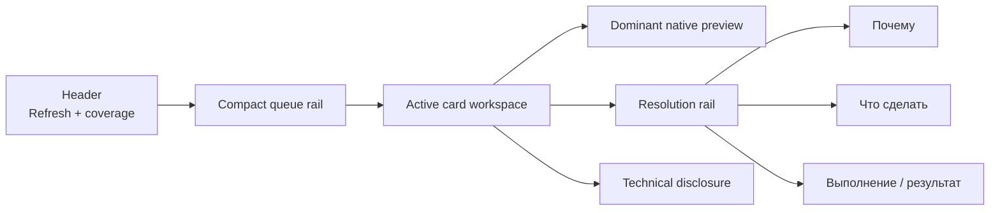

# C2 / PR #130 — Cards Prototype v3.2.3 production integration

**Дата:** 2026-07-26  
**Репозиторий:** `AliceLiddell01/anki-study-report`  
**Base branch:** `core`  
**Frozen base SHA:** `62cd4c1fc1dda6354f3e30cb3ae4aee5dfb4891f`  
**Working branch:** `c2-manual-acceptance-remediation`  
**Stage 2 start SHA:** `c6afac028e5cbf9ac6ffc1923862c71afb731798`  
**Transport commit:** `b6ebbe7feff909644d81aa607867115cf264a340`  
**Production implementation commit:** `1f78b69574794c67149796343dde8cbdd4948fb4`  
**Documentation sequence correction:** `ace37c3caa67c97e7a70b4ac499ba39b05e4e695`  
**Pull request:** `#130` — OPEN / DRAFT / UNMERGED  
**Статус:** implementation и production visual evidence завершены; owner checkpoint по Cards ожидается; Inspection Profiles 1:1 не начиналась.

## 1. Краткий результат

Stage 2 перенёс принятую композицию standalone Prototype v3.2.3 в настоящий production route `#/cards` без возвращения отклонённого global CSS overlay.

Результат:

```text
source guard                              PASS
live PR/base/head guard                   PASS
real React composition                    COMPLETE
wide Cards workspace                      COMPLETE
1024 non-modal drawer                     COMPLETE
native front/back preview                 PRESERVED
safe action/recheck lifecycle             PRESERVED
transient resolved projection             COMPLETE
RU/EN resource parity                     PASS
focused tests/typecheck/build              PASS
production visual evidence                COMPLETE
Cards owner acceptance                    PENDING
Inspection Profiles 1:1                   NOT STARTED
Fast CI / Docker / final integration gate NOT RUN
merge / release / C3                      NOT PERFORMED
```

## 2. Почему потребовался отдельный Stage 2

Предыдущий C2 closeout доказал latest-Core synchronization, удаление rejected overlay, telemetry repair, exact package и real-Anki E2E для production candidate `a746172f8746eac82ff628d36a7a6328d9332acf`.

Однако удаление overlay не являлось 1:1 переносом принятого Prototype v3.2.3. После Stage 1 оставалась отдельная задача:

- не накладывать prototype CSS поверх старой композиции;
- перестроить настоящий component tree Cards;
- сохранить канонические API/state/security contracts;
- повторно собрать visual evidence уже для production React route;
- остановиться на owner checkpoint до Inspection Profiles.

Поэтому historical Stage 1 package/E2E evidence не выдаётся за доказательство новой Stage 2 composition.

## 3. Source guard

Перед implementation были открыты и сверены:

- `README.md` и `docs/ai-handoff.md`;
- текущий `roadmap/core/README.md`;
- профильные Cards, preview, accessibility, test и security contracts;
- current production code и tests;
- independent UI review;
- accepted Prototype v3.2.3 package;
- `prototype.html`, state, interaction, accessibility и motion reports;
- real-deck E2E foundation closeout;
- real-deck E2E artifact;
- текущий PR #130 и его live state.

Live guard на момент Stage 2 start:

```text
PR #130: OPEN / DRAFT / UNMERGED
base: core
base SHA: 62cd4c1fc1dda6354f3e30cb3ae4aee5dfb4891f
head: c6afac028e5cbf9ac6ffc1923862c71afb731798
relation to core: ahead / behind 0
```

## 4. Scope

### В scope

- real JSX/component recomposition `#/cards`;
- compact header, Refresh и coverage disclosure;
- compact queue rail;
- dominant native front preview;
- separate resolution rail;
- one shared `CardsDetail` implementation для wide/drawer;
- 1024 body-level non-modal drawer;
- expanded native answer modal;
- coherent action/recheck/refresh/resolved states;
- transient resolved projection и deterministic focus transfer;
- RU/EN copy для новой composition;
- focused tests, typecheck, build и visual evidence;
- current docs, roadmap, handoff и reports.

### Вне scope

- backend/API/schema;
- detector logic;
- Inspection Profiles 1:1;
- App Shell других страниц;
- C3;
- full CI/package/Docker campaign;
- private Anki profile;
- merge PR #130;
- release/deployment/publication.

## 5. Архитектурное решение

### 5.1. До Stage 2

Широкий Cards layout был ориентирован на большую filters/control surface и отдельный Inspector. Дополнительная ширина недостаточно усиливала preview; action/recheck content конкурировал с identity и reasons.

### 5.2. После Stage 2



На `< 1200 px` active workspace переносится в body-level drawer; queue остаётся доступной.

### 5.3. Сохранённые boundaries

- `useCardsTriageWorkspace` остаётся единственным state owner;
- query/inspect/recheck используют existing APIs;
- reads сохраняют latest-wins и sequence guards;
- inspect cache остаётся bounded и generation-aware;
- native preview остаётся Shadow DOM surface;
- sanitizer, safe CSS, local media validation и CSP не ослаблены;
- Java highlighting остаётся bounded и explicit;
- frontend не читает collection напрямую;
- safe actions не расширены.

## 6. Изменения production code

| Файл | Изменение |
| --- | --- |
| `web-dashboard/src/pages/CardsPage.tsx` | новая page/header/queue/workspace composition, filter disclosure, active count, drawer host |
| `web-dashboard/src/components/cards/CardsInbox.tsx` | компактная row anatomy и resolved projection |
| `web-dashboard/src/components/cards/CardsDetail.tsx` | dominant preview, resolution rail, result projections, next-card acknowledgement |
| `web-dashboard/src/hooks/useCardsTriageWorkspace.ts` | transient resolved entity и `advanceResolved()` с focus transfer |
| `web-dashboard/src/styles/cardsInbox.css` | принятая geometry, surfaces, drawer, state/motion/reduced-motion presentation |
| `web-dashboard/src/i18n/cardsWorkspaceV323.ts` | bounded RU/EN copy override для Stage 2 composition |
| `web-dashboard/src/i18n/index.ts` | merge current locale resources с v3.2.3 workspace copy |
| профильные tests | новая composition, lifecycle, focus и localization parity |

Backend, Python runtime и package schema не изменялись.

## 7. Resolved lifecycle

### 7.1. Authority

Resolution по-прежнему определяется только authoritative exact-card recheck.

```text
action/open
→ awaiting recheck
→ explicit recheck
→ still active | partially resolved | failed/stale | resolved
```

### 7.2. Почему row не удаляется сразу

Немедленное исчезновение после recheck лишало пользователя локального подтверждения, что именно произошло, и делало focus transition визуально резким.

Stage 2 сохраняет ту же canonical entity как transient success projection:

- active reasons отсутствуют;
- priority заменён resolved state;
- row исключён из active count;
- доступен единственный primary control `К следующей карточке`.

Этот control не является manual Resolve. Server уже подтвердил отсутствие причин. Control только закрывает success feedback и переводит пользователя дальше.

### 7.3. Focus

После acknowledgement:

1. следующий item в той же queue position;
2. предыдущий item;
3. queue heading, если queue пуста.

Focused hook test подтверждает эту последовательность.

## 8. Accessibility и interaction

Подтверждены:

- ordered list и native button на row;
- одна Tab-stop на item;
- visible focus и `aria-current`;
- drawer `role=region`, не dialog;
- отсутствие backdrop, inert и focus trap у drawer;
- Escape close и focus restoration;
- modal answer использует existing portal/focus trap;
- polite live status lifecycle;
- busy semantics для refresh/action/recheck;
- reduced-motion path;
- RU/EN parity.

## 9. Focused verification

Локальный runnable checkout был собран из branch source и pnpm 9.15.9 dependencies.

| Проверка | Результат |
| --- | --- |
| TypeScript `tsc --noEmit` | PASS |
| Focused Vitest | PASS — 7 files / 34 tests |
| Vite production build | PASS — 2279 modules transformed |
| Bundle guard | PASS — 21 JavaScript chunks |
| `git diff --check` | PASS |

Focused test set:

```text
src/i18n/resources.test.ts
src/pages/CardsPage.test.tsx
src/hooks/useCardsTriageWorkspace.test.tsx
src/components/AnkiCardShadowPreview.test.tsx
src/components/AnkiCardShadowPreviewHighlighting.test.tsx
src/lib/cardCodeHighlighting.test.ts
src/components/cards/CardsDetailDrawer.test.tsx
```

Bundle diagnostics:

```text
entry: 436151 bytes
total JavaScript: 1409011 bytes
gzip: 398610 bytes
```

## 10. Production visual evidence

### 10.1. Identity

Evidence package:

```text
name: cards-v323-production-evidence.zip
files: 88
size: approximately 16 MiB
SHA-256: c469c4b6addb7e34beca393d13126b97ef413fd4906c85b4bb548d4f98bd6139
```

Capture contour:

- actual Vite production build;
- actual React `#/cards` route;
- exact serialized report/search-preview payload из existing real-deck E2E artifact;
- media extracted from committed APKG fixtures;
- intercepted validated `/api/media` responses;
- Chromium, device scale factor 1;
- `1440×900` и `1024×768`.

### 10.2. Screenshot matrix

| Группа | Production files |
| --- | --- |
| Main | `production/cards-1440-dark-main.png`, `production/cards-1440-light-main.png` |
| Words | `production/words-1440-dark.png`, `production/words-1440-light.png` |
| Grammar | `production/grammar-1440-dark.png`, `production/grammar-1440-light.png` |
| Java | `production/java-1440-dark.png`, `production/java-1440-light.png` |
| 1024 drawer | `production/cards-1024-dark-drawer-cta.png`, `production/cards-1024-light-drawer-cta.png` |
| Action | `production/cards-1440-dark-action-pending.png`, light/dark failure captures |
| Recheck | awaiting, pending, failed, still-active captures |
| Refresh | pending, success и failure captures |
| Resolved | `production/cards-1440-dark-resolved.png` |
| Modal | `production/cards-1440-dark-expanded-answer.png` |
| Multiple reasons | main real-deck anchor с тремя canonical reasons |

### 10.3. Comparison package

Для ключевых contours включены:

```text
prototype reference
production screenshot
side-by-side
50% alpha overlay
amplified absolute pixel diff
```

Compared contours:

- `main-dark`;
- `drawer-1024-light`;
- `awaiting-recheck-dark`;
- `recheck-pending-dark`;
- `still-active-dark`;
- `resolved-dark`;
- `action-failure-light`;
- `recheck-failed-light`;
- `refresh-pending-light`;
- `refresh-failure-light`;
- `refresh-success-light`.

### 10.4. Pixel diagnostics

Pixel diff используется только как diagnostic, не как pass/fail threshold: prototype и production используют разные real content, counts и текущий App Shell.

| Contour | Size | Mean absolute RGB difference |
| --- | ---: | ---: |
| `main-dark` | 1440×900 | 44.37 |
| `drawer-1024-light` | 1024×768 | 18.61 |
| `awaiting-recheck-dark` | 1440×900 | 45.79 |
| `recheck-pending-dark` | 1440×900 | 44.63 |
| `still-active-dark` | 1440×900 | 48.07 |
| `resolved-dark` | 1440×962 | 44.51 |
| `action-failure-light` | 1440×900 | 14.73 |
| `recheck-failed-light` | 1440×900 | 14.98 |
| `refresh-pending-light` | 1440×962 | 14.62 |
| `refresh-failure-light` | 1440×962 | 15.45 |
| `refresh-success-light` | 1440×900 | 14.94 |

### 10.5. Known differences

Accepted/bounded:

- current production App Shell вместо standalone prototype shell;
- real-deck identities/content вместо demo data;
- production main anchor содержит три canonical reasons;
- single-reason real-deck anchor используется для first-viewport 1024 CTA contour;
- Chromium fonts, native controls, scrollbars и antialiasing отличаются;
- dynamic counts отражают пять selected real-deck anchors, а не prototype demo rows.

Не считаются допустимыми различиями:

- другой region order;
- широкая queue вместо compact rail;
- потеря preview dominance;
- перенос resolution rail;
- modal drawer вместо non-modal region;
- немедленное исчезновение resolved row;
- отсутствующие controls;
- permanent filter wall.

### 10.6. Почему PNG не находятся в Git tree

Project hygiene запрещает коммитить generated screenshots, comparisons, E2E outputs и capture-only payloads. Поэтому report хранит identity, hash, matrix и known differences, а бинарное evidence поставляется отдельно.

Ни screenshots, ни ZIP не входят в `.ankiaddon` package.

## 11. Git publication

Stage 2 опубликован тремя commits без force-push:

```text
b6ebbe7feff909644d81aa607867115cf264a340
Stage the verified Cards integration patch

1f78b69574794c67149796343dde8cbdd4948fb4
Recompose the Cards workspace around the accepted prototype

ace37c3caa67c97e7a70b4ac499ba39b05e4e695
Correct the Cards and Profiles integration sequence
```

Transport workflow:

- проверил SHA-256 двух prepared patch blocks;
- применил их через `git apply --index --whitespace=error`;
- создал production и documentation commits;
- удалил `.stage2-patch/` и temporary workflow из итогового tree;
- не выполнял force-push.

## 12. Что не проверено

```text
full frontend Vitest: NOT RUN for Stage 2
full Python suite: NOT RUN for Stage 2
canonical run_full_check.ps1 -SkipDocker: NOT RUN for Stage 2
Fast CI/package artifact: NOT RUN for Stage 2
Docker/real-Anki E2E: NOT RUN for Stage 2
private-profile owner acceptance: NOT PERFORMED
Inspection Profiles 1:1: NOT STARTED
final integration verification: NOT RUN
```

Предыдущие Stage 1 Fast CI `30173712679` и real-Anki E2E `30174041436` остаются historical baseline для pre-Stage-2 package, но не доказывают новую Cards composition.

## 13. Остаточные риски

- private note types и media могут выявить collection-specific visual issue;
- platform font/scrollbar raster отличается от capture environment;
- very long RU/EN labels требуют owner observation на реальном desktop;
- 1024 drawer wheel/scroll ownership требует private-profile acceptance;
- safe CSS fidelity намеренно ограничена allowlist;
- Stage 2 head не имеет нового exact package/E2E identity;
- owner может потребовать bounded visual revision до Stage 3.

## 14. Документация

Актуальный contract:

- [Cards workspace по Prototype v3.2.3](../../docs/cards-v323-production-workspace.md);
- [Cards attention inbox](../../docs/cards-attention-inbox.md);
- [Canonical resolution loop](../../docs/cards-v2-resolution-loop.md);
- [Card preview semantics](../../docs/card-preview-semantics.md);
- [Frontend map](../../docs/frontend-map.md).

Исторический Stage 1 closeout:

- [C2 post-merge manual acceptance remediation](c2-manual-acceptance-remediation-closeout.md).

## 15. Решение и следующий шаг

```text
Stage 2 implementation/evidence COMPLETE
→ owner checkpoint: ACCEPT CARDS 1:1 или REVISE
→ только после ACCEPT: Stage 3 Inspection Profiles 1:1
→ Profiles owner checkpoint
→ final verification
→ separate merge decision for PR #130
```

PR остаётся OPEN / DRAFT / UNMERGED. C3, release и publication не активируются автоматически.
