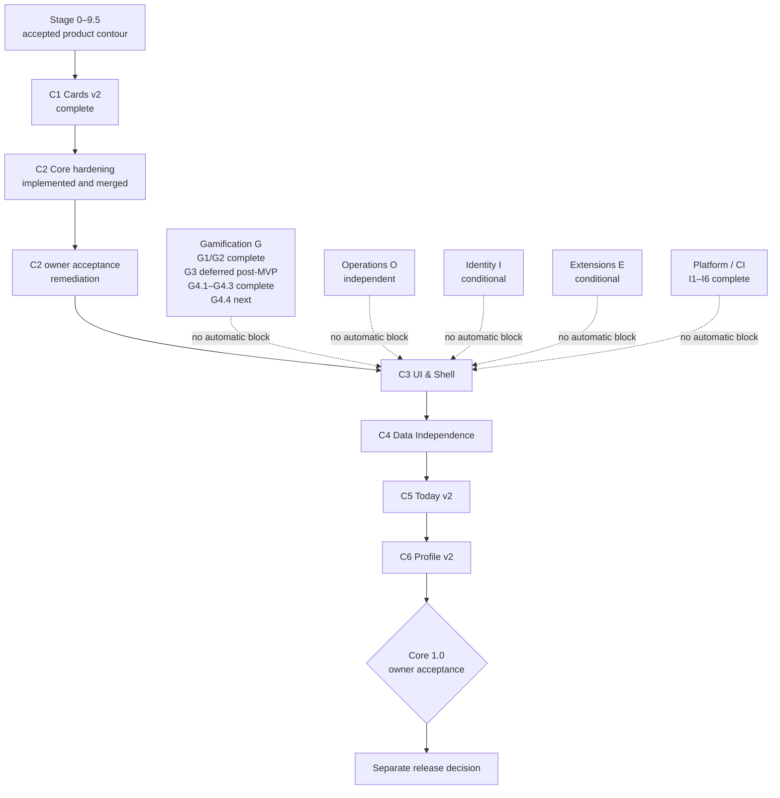

# Roadmap Anki Study Report

**Снимок:** 2026-07-28

Roadmap разделён на один обязательный продуктовый путь **Core** и независимые либо условные треки. Больший номер не создаёт общей очереди между разными направлениями.

## Общая карта



## Состояние треков

| Трек | Роль | Текущий статус | Следующая точка |
| --- | --- | --- | --- |
| [Core `C`](core/README.md) | единственный обязательный путь add-on | C2 влит; owner acceptance открыта | bounded C2 remediation, затем C3 |
| [Gamification `G`](gamification/README.md) | research и необязательный продукт | G0/G1/G2 complete; G3 deferred post-MVP; G4 in progress; G4.1–G4.3 complete; candidate protocol frozen pre-screening; production не одобрен | G4.4 bounded screening — next / not started; отдельная активация обязательна |
| [Operations `O`](operations/README.md) | защищённые admin-инструменты telemetry | независимый условный трек | O1 только при operational trigger |
| [Identity `I`](identity/README.md) | optional continuity/recovery gate | не запланирован | I1 только при конкретном cross-device workflow |
| [Extensions `E`](extensions/README.md) | first-party extension ecosystem | условный/отложенный | E1 только с reference pack |
| [Platform / CI](platform/README.md) | CI/CD, точные артефакты и E2E в реальном Anki | E2E-I1–I6 и bounded corrective fix завершены | нет активного этапа; CI 7–12 только по отдельному trigger |

Профильный [`roadmap/gamification/README.md`](gamification/README.md) является источником актуального статуса Gamification внутри ветки `gamification`. Core mirror не переопределяет завершённые G0–G2 и frozen G4 contracts.

## Как читать roadmap

Каждый этап должен содержать:

- цель;
- статус;
- зависимости и activation criteria;
- scope и out of scope;
- completion criteria.

Roadmap не является production contract. Приоритет источников:

```text
production/research code и tests
→ docs/
→ roadmap/
→ reports/
```

## Границы

- `docs/` — текущее поведение и обязательные contracts;
- `roadmap/` — будущее развитие и зависимости;
- `reports/` — исторические audits, measurements и closeout evidence.

Завершённые run IDs, SHA и artifacts не дублируются в корневой roadmap. Они находятся в [reports](../reports/README.md) или профильных canonical closeouts.

## Общие правила

1. Параллельный трек не блокирует Core без документированной зависимости.
2. Placeholder UI и speculative APIs не добавляются заранее.
3. Payload/public behavior меняются синхронно между backend, frontend types, tests и docs.
4. Runtime artifacts, logs, screenshots, tokens, profile data и `.ankiaddon` не коммитятся.
5. Verification следует [test matrix](../docs/test-matrix.md) и [run policy](../docs/verification-run-policy.md).
6. Successful unchanged exact-SHA E2E не повторяется.
7. Merge, release и publication — разные решения.
8. Один крупный этап не дробится на бесконечную лестницу подпунктов.
9. Research candidate не называется production-ready до отдельного решения.
10. G3/Create XP не входит в initial core economy и возвращается только после первого стабильного Gamification release, отдельного owner decision и evidence-backed trigger.
11. G4.3 заморозил prospective candidate protocol и dry matrix, но не запустил screening, simulation или production work.
12. G4.4 не активируется автоматически после G4.3 и не может менять frozen protocol post hoc без явного amendment record.

## Словарь статусов

- **Complete** — обязательный результат существует и прошёл заявленные gates.
- **Merged** — candidate интегрирован в целевую долгоживущую ветку.
- **Owner acceptance open** — автоматические gates пройдены, но ручная проверка выявила незакрытый gap.
- **Next** — следующая рекомендуемая работа внутри трека.
- **Conditional** — активируется только при явном trigger.
- **Deferred** — намеренно вне текущего горизонта.
- **Research only** — не входит в production/package/CI.
