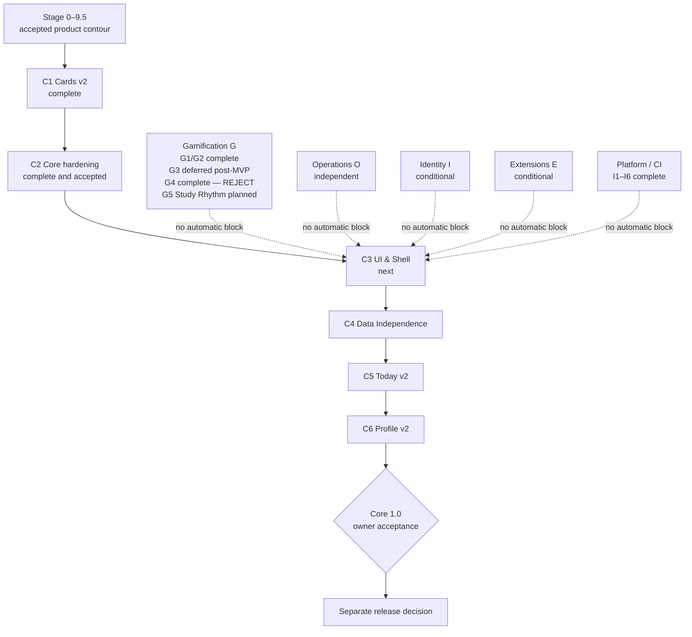

# Roadmap Anki Study Report

**Снимок:** 2026-07-29

Roadmap разделён на один обязательный продуктовый путь **Core** и независимые либо условные треки. Больший номер не создаёт общей очереди между разными направлениями.

## Общая карта



## Состояние треков

| Трек | Роль | Текущий статус | Следующая точка |
| --- | --- | --- | --- |
| [Core `C`](core/README.md) | единственный обязательный путь add-on | C1 и C2 завершены; C2 acceptance закрыта | C3 UI & Shell |
| [Gamification `G`](gamification/README.md) | research и необязательный продукт | G0–G2 complete; G3 deferred post-MVP; G4/G4.4 complete with `REJECT`; G5 Study Rhythm MVP planned, implementation not started | bounded `core → gamification` sync, затем G5 vertical slice по [G5–G8 roadmap](gamification/g5-g8-product-roadmap.md) |
| [Operations `O`](operations/README.md) | защищённые admin-инструменты удалённых сервисов | O1 активирован; O2 условный | O1 в отдельном Operations-контуре |
| [Identity `I`](identity/README.md) | optional continuity/recovery gate | не запланирован | I1 только при конкретном cross-device workflow |
| [Extensions `E`](extensions/README.md) | first-party extension ecosystem | условный/отложенный | E1 только с reference pack |
| [Platform / CI](platform/README.md) | CI/CD, точные артефакты и E2E в реальном Anki | E2E-I1–I6 и bounded corrective fix завершены | нет активного этапа; CI 7–12 только по отдельному trigger |

Профильный [`roadmap/gamification/README.md`](gamification/README.md) является источником актуального статуса Gamification внутри ветки `gamification`. Core mirror не переопределяет завершённые G0–G2 и frozen G4 contracts.

Operations остаётся независимым от локального add-on. Подробная принятая граница O1/O2, privacy, authorization и remote-service scope хранится в [профильном roadmap Operations](operations/README.md).

## Как читать roadmap

Каждый этап должен содержать:

- цель;
- статус;
- зависимости и activation criteria;
- scope и out of scope;
- completion criteria.

Roadmap не является production contract. Приоритет источников:

```text
production/research code и tests
→ docs/
→ roadmap/
→ reports/
```

## Границы

- `docs/` — текущее поведение и обязательные contracts;
- `roadmap/` — будущее развитие и зависимости;
- `reports/` — исторические audits, measurements и closeout evidence.

Завершённые run IDs, SHA и artifacts не дублируются в корневой roadmap. Они находятся в [reports](../reports/README.md) или профильных canonical closeouts.

## Общие правила

1. Параллельный трек не блокирует Core без документированной зависимости.
2. Placeholder UI и speculative APIs не добавляются заранее.
3. Payload/public behavior меняются синхронно между backend, frontend types, tests и docs.
4. Runtime artifacts, logs, screenshots, tokens, profile data и `.ankiaddon` не коммитятся.
5. Verification следует [test matrix](../docs/test-matrix.md) и [run policy](../docs/verification-run-policy.md).
6. Successful unchanged exact-SHA E2E не повторяется.
7. Merge, release и publication — разные решения.
8. Один крупный этап не дробится на бесконечную лестницу подпунктов.
9. Research candidate не называется production-ready до отдельного решения.
10. G3/Create XP не входит в initial core economy и возвращается только после первого стабильного Gamification release, отдельного owner decision и evidence-backed trigger.
11. G4.4 исполнил replacement protocol v4 и закрыл G4 outcome `REJECT`; v4 не меняется post hoc.
12. G5 planning одобрен владельцем, но implementation не начинается автоматически из-за публикации roadmap.
13. G5 заканчивается рабочим packaged Study Rhythm MVP и не включает XP, levels, Learn XP, Create XP или cross-domain conversion.
14. G6 economy требует нового prospective protocol и отдельного production approval; G4 `REJECT` нельзя обходить переименованием кандидатов.

## Словарь статусов

- **Complete** — обязательный результат существует и прошёл заявленные gates.
- **Merged** — candidate интегрирован в целевую долгоживущую ветку.
- **Owner accepted** — обязательные автоматические gates и требуемая ручная приёмка завершены.
- **Next** — следующая рекомендуемая работа внутри трека.
- **Planned** — направление и границы зафиксированы, implementation ещё не начат.
- **Conditional** — активируется только при явном trigger.
- **Deferred** — намеренно вне текущего горизонта.
- **Research only** — не входит в production/package/CI.

## Gamification G4 closure

```text
G4: COMPLETE
G4.3: COMPLETE
G4.3 v1: SUPERSEDED_PRE_EXECUTION
G4.3 v2: SUPERSEDED_PRE_EXECUTION
G4.3 v3: INVALIDATED_AFTER_SCREENING
G4.3 v4: FROZEN_AND_EXECUTED
G4.4: COMPLETE
final G4 outcome: REJECT
production integration: PROHIBITED
```

## Gamification post-G4 direction

```text
G5: STUDY RHYTHM MVP / PLANNED / NOT STARTED
G6: PERSONAL PROGRESSION ECONOMY V1 / CONDITIONAL / NOT STARTED
G7: ACHIEVEMENTS FOUNDATION / CONDITIONAL / NOT STARTED
G8: SKILLS, QUESTS AND DOMAIN EXPANSION / DEFERRED / CONDITIONAL / NOT STARTED
```

Detailed plan: [`roadmap/gamification/g5-g8-product-roadmap.md`](gamification/g5-g8-product-roadmap.md).
