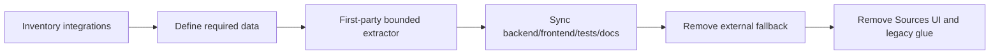

# Продуктовая ветка Core

**Трек:** `C`
**Роль:** единственный обязательный последовательный путь основного add-on
**Снимок:** 2026-07-28

Core не зависит от Gamification, Operations, Identity или Extensions. Platform / CI обслуживает delivery contour, но не меняет продуктовый scope без явной зависимости.

## Карта Core 1.0

```mermaid
flowchart LR
    C1[C1 Cards v2<br/>complete] --> C2[C2 Hardening<br/>base merged]
    C2 --> S1[PR #130 Stage 1<br/>sync + overlay cleanup]
    S1 --> S2[Cards 1:1<br/>composition + bounded corrections]
    S2 --> OC[Owner checkpoint Cards<br/>ACCEPTED]
    OC --> PA[Inspection Profiles<br/>screenshot-first audit]
    PA --> S3[Inspection Profiles 1:1]
    S3 --> OP{Owner checkpoint<br/>Profiles}
    OP --> FV[Final verification]
    FV --> MI{Separate PR #130<br/>merge decision}
    MI --> C3[C3 UI & Shell]
    C3 --> C4[C4 First-party Data]
    C4 --> C5[C5 Today v2]
    C5 --> C6[C6 Profile v2]
    C6 --> OA{Core 1.0<br/>owner acceptance}
    OA --> REL[Separate release decision]

    B[C1.6B bulk actions]:::conditional
    X[Contextual additions]:::conditional
    C1 -. evidence trigger .-> B
    C5 -. evidence trigger .-> X

    classDef conditional stroke-dasharray: 5 5;
```



## Текущий статус

```text
C1 — завершён и принят
C2 base implementation/integration — завершены и влиты
PR #130 Stage 1 sync + rejected-overlay cleanup — COMPLETE
PR #130 Stage 2 Cards 1:1 — ACCEPTED / COMPLETE / FROZEN
Cards technical blockers — NONE
Cards accessibility blockers — NONE
Inspection Profiles corrected screenshot-first audit — COMPLETE; visual target locked
WP1 Settings shared shell — IMPLEMENTATION CANDIDATE DELIVERED
WP1 Settings external visual review — PENDING
WP2 Inspection Profiles header/catalog/workspace frame — IMPLEMENTATION CANDIDATE DELIVERED
WP2 Inspection Profiles external visual review — PENDING
Inspection Profiles Basic/Advanced inner implementation — NOT STARTED
WP2 consolidated automated verification — PASS
отдельное решение о merge PR #130 — NOT PERFORMED
C3–C6 — обязательный будущий путь; C3 не активирован автоматически
release — не начат
```

## Правила поставки

- один крупный этап решает одну продуктовую или архитектурную задачу;
- implementation groups не создают лестницу `C3.1.a`;
- merge в `core`, sync с `master`, release и publication — отдельные решения;
- placeholder UI не добавляется заранее;
- force-push запрещён без явного одобрения;
- commit messages описывают фактическое изменение.

## Завершённая основа

### C1 — Cards v2 / Problem Triage

C1 завершён и принят. Канонический single-card lifecycle:

```text
problem
→ Safe Action или Open in Anki
→ Awaiting recheck
→ exact-card recheck
→ active | partial | resolved | failed | stale
```

Актуальные contracts:

- [Cards v2 product contract](../../docs/cards-v2-product-contract.md)
- [Triage read API](../../docs/cards-v2-triage-read-api.md)
- [Single-card resolution loop](../../docs/cards-v2-resolution-loop.md)
- [Inspection Profiles](../../docs/inspection-profiles-v1.md)

Исторические C1 evidence: [reports/core](../../reports/README.md).

### C2 — Core 1.0 Hardening

**Implementation:** complete
**Integration:** merged в `core`
**Stage 1 synchronization/rejected-overlay cleanup:** complete в draft PR #130
**Stage 2 Cards 1:1:** owner accepted, complete и frozen — [contract](../../docs/cards-v323-production-workspace.md), [report](../../reports/core/c2-cards-final-av-media-evidence-closeout.md)
**Inspection Profiles corrected screenshot-first audit:** complete
**WP1 Settings shared shell:** implementation candidate delivered; external visual review pending — [report](../../reports/core/c2-settings-shell-wp1-implementation.md)
**WP2 Inspection Profiles header/catalog/workspace frame:** implementation candidate delivered; external visual review pending — [report](../../reports/core/c2-inspection-profiles-wp2-frame-implementation.md)
**Inspection Profiles Basic/Advanced inner implementation:** not started

Полный implementation ledger: [C2 closeout](../../reports/core/c2-core-hardening-ui-remediation.md).

Автоматизированная remediation закрыла:

- preview fidelity и wheel ownership;
- заметный локальный feedback Safe Actions/Open in Anki/Recheck;
- взаимоисключающие Basic/Advanced Inspection Profiles;
- container-aware editor/layout;
- bounded suggestions и field-role inference;
- согласованную motion/shape foundation;
- exact Fast CI package и final `standard/full` с restart.

Stage 1 проверенный production candidate: `a746172f8746eac82ff628d36a7a6328d9332acf`; подробности: [C2 manual acceptance remediation closeout](../../reports/core/c2-manual-acceptance-remediation-closeout.md). Stage 2 initial Cards production commit: `1f78b69574794c67149796343dde8cbdd4948fb4`; bounded visual revision: `34a7680392ee7e17dc3ee826dad5bdf9808bc3d1`; native Anki night-mode correction: `f288595499904eadeb81c4ceab3da232581c30f5`; final native preview/visual closure: `c2c2b65b399907010ff7e2d40307b1ded02a1bc3`; native template CSS fidelity repair: `adfe628e45d8aac59df26f6a4e19b8e45c0cf5d5`; visual parity closure: `ce45194e659aeba43f05a2b13cbf6f0583e601aa`; final accepted production package source: `a162dde223b1bc40b6b0f566ae1fb5d665089359`; final evidence harness: `5487bb32d43b11bbe618ec45e1b0e1e365fabb39`; final artifact: `cards-final-av-media-fidelity-evidence.zip`, SHA-256 `539cf5f08c5f804fa6de3b87c87f0792e6d60777f0b40a9c413a0b912516dfc3`; подробности: [Cards owner acceptance closeout](../../reports/core/c2-cards-final-av-media-evidence-closeout.md).

Это closure существующего C2, а не новый numbered stage.

Критерии закрытия:

| Критерий | Статус |
| --- | --- |
| security/CSP/sanitizer boundary не ослаблена | PASS |
| targeted/final real-Anki gates соответствуют риску | PASS |
| UI states работают на representative fixtures | PASS |
| владелец принимает Cards 1:1 на route `#/cards` | PASS — `ACCEPT CARDS 1:1` |

Cards production frozen. Без новой доказанной регрессии запрещено менять Cards composition, queue, rail, drawer, expanded answer, native preview, AV/audio/GIF path, Shadow DOM или Cards styles ради Settings. Успешный тяжёлый Cards real-Anki gate не повторяется без нового риска.

`ACCEPT CARDS 1:1` относится только к route `#/cards` и не означает принятие PR #130. После Cards checkpoint обязательны отдельные Profiles implementation/acceptance, Settings regression sweep, final verification и отдельное решение о merge; до этого C3 не начинается автоматически.

Будущий visual acceptance threshold для Inspection Profiles:

```text
minimum acceptable result: 8.5/10
preferred target: 9.0/10 or higher
```

## C3 — Core UI & Shell Consolidation

**Статус:** не активирован; возможен только после Profiles checkpoint, final verification и отдельного merge decision по PR #130

### Цель

Создать общую visual/content/composition system dashboard, не подменяя отдельные продуктовые этапы Today и Profile.

### Scope

- полноширинный desktop shell без глобального узкого `max-width`;
- shared `PageHeader`, typography, spacing, shape, surface и motion tokens;
- ограниченная semantic hierarchy surfaces;
- `prefers-reduced-motion`, light/dark, RU/EN;
- удаление obsolete Tools/Report surfaces;
- Search как utility navigation action;
- site-wide cleanup повторов и бессодержательного текста.

### Вне scope

- функциональный redesign Today;
- Profile v2 или Gamification;
- First-party Data work C4;
- mobile-first redesign;
- новые product features.

### Completion

- сохраняемые routes используют shared primitives;
- desktop width используется функционально;
- obsolete shell surfaces удалены вместе с code/tests/docs;
- representative routes проверены на 1920/1440/1280/1024, zoom, keyboard и focus;
- owner принимает visual evidence.

## C4 — First-party Data Independence

**Статус:** после C3



Правила:

- не копировать сторонний код без license/architecture review;
- не заменять зависимость raw SQL или generic RPC;
- каждая сохраняемая функция получает first-party bounded source либо удаляется;
- diagnostics остаются в Logs/Diagnostics.

Completion:

- Core работает без сторонних Anki add-ons;
- полезные данные имеют first-party contract;
- неиспользуемые integrations и Sources surface удалены;
- external add-on disablement не ломает Core smoke.

## C5 — Today v2

**Статус:** после C4

Today отвечает только на четыре вопроса:

```text
что у меня сегодня
сколько уже сделано
что требует внимания
что лучше сделать следующим
```

Scope:

- daily context и план;
- reviews/new/time/progress;
- одно главное действие продолжения;
- bounded attention block;
- streak и прогноз завершения;
- короткие переходы в профильные surfaces.

Не дублировать Statistics, Activity, Decks, Cards или FSRS.

Completion: пользователь за несколько секунд понимает daily state и следующий шаг; empty/complete/overdue/error states проверены.

## C6 — Profile v2 Foundation

**Статус:** после C5

### Цель

Сделать Profile зрелой local identity/progress surface и подготовить реальные данные для возможного G-track без фиктивных игровых функций.

### Scope

- nickname, description, local avatar/banner и start date;
- safe media validation/replacement;
- полноширинная composition;
- activity, milestones и реальные учебные показатели;
- stable local identity для будущего progression.

### Не добавлять заранее

- фиктивный Level/XP;
- achievements, skills или quests «скоро»;
- economy без принятого G-track.

Completion: identity сохраняется локально, media безопасны, Profile не дублирует Statistics/Activity и использует C3 foundation.

## Core 1.0 gate

Перед отдельным решением о release должны быть приняты:

```text
C2 manual acceptance remediation
C3 UI & Shell
C4 First-party Data
C5 Today v2
C6 Profile v2
```

Release требует актуальных docs/navigation, package/CI/real-Anki gates и отдельного owner approval.

## Условные дополнения

### C1.6B — limited bulk actions

Активируется только при повторяющемся реальном сценарии, где один Safe Action нужен минимум для 5–10 карточек и Anki Browser решает задачу заметно хуже.

### Contextual additions

Не имеют заранее зарезервированного stage. Каждое предложение обязано доказать:

- конкретный пользовательский вопрос;
- доступные bounded data;
- место в IA;
- interpretation rules;
- отсутствие ответа в существующих surfaces;
- verification criteria.
