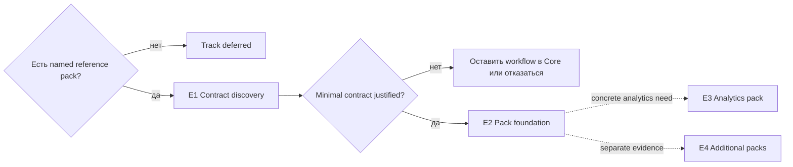

# Трек Extension Ecosystem

**Трек:** `E`  
**Роль:** условная first-party extension architecture  
**Текущий статус:** `E1` — conditional

Core должен оставаться полноценным и releasable без extension system. Трек начинается только с конкретного first-party reference pack.

## Карта

## Этапы

| Этап | Статус | Цель | Completion |
| --- | --- | --- | --- |
| **E1 Contract discovery** | Conditional | Вывести минимальный contract из одного approved reference pack | proposal доказывает каждую capability и отклоняет speculative surface |
| **E2 Minimal foundation** | После E1 | Реализовать versioned fail-closed first-party extension points | install/update/uninstall/recovery проходят; Core работает без pack |
| **E3 Analytics pack** | Conditional | Вынести один optional/expensive analytical workflow | pack отдельно удаляем, metrics canonical, Core performance/data не затронуты |
| **E4 Additional packs** | Deferred | Добавлять один evidence-backed first-party pack за раз | у каждого pack есть owner, security review и maintenance case |

## Invariants

- никаких unsigned remote code, generic iframe/JavaScript plugins или arbitrary UI slots;
- frontend pack не получает прямой collection access;
- capability allowlist и compatibility versioned;
- package/tests/lifecycle отделены от Core;
- token, sanitizer, action и media boundaries сохраняются;
- marketplace и third-party ecosystem не подразумеваются.

## Activation criteria

E1 требует named workflow, ownership, maintenance plan и доказательство, что функция не должна оставаться bounded Core addition. E2–E4 не активируются заранее.
