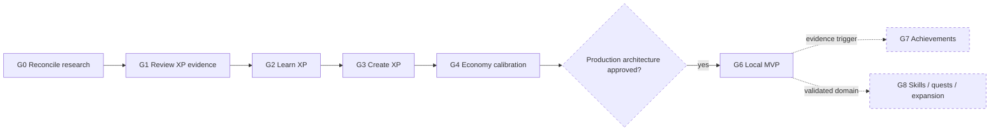

# Трек Gamification

**Трек:** `G`  
**Роль:** параллельное research/product направление  
**Текущий статус:** `G0` — следующий; production integration не одобрена

Gamification не блокирует Core. Research code, fixtures и generated evidence не входят в add-on package, Fast CI или release без отдельного решения.

Исторический аудит исходной research-ветки и внешней evidence base вынесен в отдельный отчёт: [gamification source audit](../../reports/research/gamification-track-source-audit-2026-07-18.md).

## Карта этапов

## Product principles

- autonomy, competence и opt-out важнее механического роста points;
- engagement metrics не подменяют learning outcomes;
- competition и leaderboards не являются default;
- reward model должен быть explainable, abuse-resistant и longitudinally tested;
- production остаётся local-first до отдельного Identity decision;
- placeholder XP, levels и achievements запрещены.

## Этапы

| Этап | Статус | Цель | Gate завершения |
| --- | --- | --- | --- |
| **G0 Research reconciliation** | Next | Перенести валидные research assets на актуальную базу без wholesale merge исторической ветки | master/core-based research package воспроизводим, superseded evidence помечено, production files не меняются |
| **G1 Review XP evidence** | Blocked by G0 | Закрыть cross-horizon retention-cycling gap | gate проходит либо Review model явно rejected/deferred |
| **G2 Learn XP** | Planned | Определить initial-learning events, pending/confirmed rewards и anti-farming | versioned spec и reproducible simulation evidence |
| **G3 Create XP** | Planned | Вознаграждать полезные state transitions без card spam/edit farming | bounded reward и resistance к duplicate/reset/import abuse |
| **G4 Economy calibration** | After G1–G3 | Свести Review/Learn/Create, level curve, streak, rest, Momentum и recovery | candidate проходит fairness/workload/abuse/long-horizon gates |
| **G5 Production architecture** | Conditional | Спроектировать local-first ledger, migrations и reconciliation до UI | threat model, data model, migrations, API boundaries и verification approved |
| **G6 Gamification MVP** | Conditional | Level/XP, streak с planned rest, Momentum, explanations, settings/opt-out | migrations, accessibility, privacy и real-Anki verification проходят |
| **G7 Achievements** | Conditional | Добавить durable milestones при доказанном feedback gap | rules bounded, explainable, optional и retroactively safe |
| **G8 Skills/quests/expansion** | Deferred | Расширять один подтверждённый domain/workflow за раз | собственная taxonomy, calibration, privacy и maintenance ownership |

## Общие границы

### Research scope

- versioned specifications;
- deterministic scenarios/simulators;
- matched longitudinal evidence;
- fairness, abuse и sensitivity gates;
- explicit reject/defer outcomes.

### Не входит без отдельного решения

- production storage/API/UI;
- accounts и remote study history;
- leaderboards/marketplace;
- generic life-tracking framework;
- изменение Anki scheduling;
- включение research dependencies в package или Fast CI.

## Activation production work

G5 начинается только когда G4 принят владельцем и economy достаточно стабильна для versioned persistence. G6 требует отдельного product approval. G7/G8 не резервируют будущий UI и активируются только по evidence.
