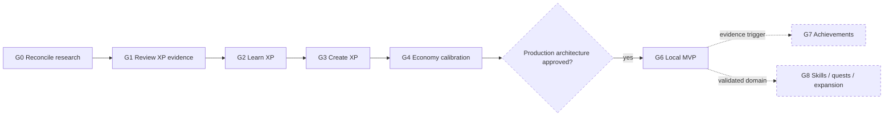

# Трек Gamification

**Трек:** `G`  
**Роль:** параллельное research/product направление  
**Текущий статус:** `G0` — следующий; production integration не одобрена

Gamification не блокирует Core. Research code, fixtures и generated evidence не входят в add-on package, Fast CI или release без отдельного решения.

Исторический аудит исходной research-ветки и внешней evidence base вынесен в отдельный отчёт: [gamification source audit](../../reports/research/gamification-track-source-audit-2026-07-18.md).

## Карта этапов

## Product principles

- autonomy, competence и opt-out важнее механического роста points;
- engagement metrics не подменяют learning outcomes;
- competition и leaderboards не являются default;
- reward model должен быть explainable, abuse-resistant и longitudinally tested;
- production остаётся local-first до отдельного Identity decision;
- placeholder XP, levels и achievements запрещены.

## Краткая карта

| Этап | Статус | Цель | Gate завершения |
| --- | --- | --- | --- |
| **G0 Research reconciliation** | Next | Перенести валидные research assets на актуальную базу без wholesale merge | current-base research package воспроизводим, superseded evidence помечено |
| **G1 Review XP evidence** | Blocked by G0 | Закрыть cross-horizon retention-cycling gap | gate проходит либо Review model явно rejected/deferred |
| **G2 Learn XP** | Planned | Определить initial-learning rewards и anti-farming | versioned spec и reproducible simulation evidence |
| **G3 Create XP** | Planned | Вознаграждать полезные state transitions без spam/farming | bounded reward и resistance к duplicate/reset/import abuse |
| **G4 Economy calibration** | After G1–G3 | Свести XP domains, level curve, streak, rest, Momentum и recovery | fairness/workload/abuse/long-horizon gates |
| **G5 Production architecture** | Conditional | Спроектировать local-first ledger, migrations и reconciliation | threat model, data model и API boundaries approved |
| **G6 Gamification MVP** | Conditional | Level/XP, streak, Momentum, explanations и opt-out | migrations, accessibility, privacy и real-Anki verification |
| **G7 Achievements** | Conditional | Добавить milestones при доказанном feedback gap | rules bounded, explainable, optional и retroactively safe |
| **G8 Skills/quests/expansion** | Deferred | Расширять один подтверждённый workflow/domain за раз | отдельная taxonomy, calibration, privacy и ownership |

## Stage contracts

### G0 — Research reconciliation

**Dependencies:** read access к historical branch; Core не блокирует этап.

**Scope:**

- inventory documents, contracts, source, scenarios, schemas, tests и evidence;
- reconcile repository drift;
- rerun и записать фактические test/scenario/oracle counts;
- отделить current results от superseded reports;
- решить, какие assets imported, rewritten, archived или discarded;
- сохранить research package isolation.

**Вне scope:**

- production add-on integration;
- изменение XP formulas только ради зелёных checks;
- wholesale merge/rebase historical branch;
- Fast CI или package inclusion.

**Completion:** актуальная research branch/PR содержит self-consistent package и docs; checks воспроизводимы; production/runtime/workflow files не меняются.

### G1 — Review XP cross-horizon evidence

**Dependencies:** executable G0 baseline, persistent matched-card longitudinal simulator, versioned candidate/evidence contracts.

**Scope:**

- defensible candidate hypotheses;
- matched 90/365-day и sensitivity runs;
- hard gates до Pareto ranking;
- explicit reject/defer decision при недостаточной evidence.

**Вне scope:** production economy, Learn/Create XP и изменения Anki scheduling.

**Completion:** cycling growth gate проходит под documented tolerances либо Review model явно rejected/deferred. Research candidate не называется production-ready.

### G2 — Learn XP

**Dependencies:** G1 complete и stable evidence methodology.

**Scope:**

- event taxonomy initial learning;
- pending/confirmed reward transitions;
- delayed confirmation;
- Undo/import/sync semantics;
- fairness и abuse scenarios;
- simulation.

**Вне scope:** production ledger/UI и universal Review/Learn formula.

**Completion:** versioned specification и reproducible simulator evidence; values остаются research-only.

### G3 — Create XP

**Dependencies:** G2 methodology и ясные Cards/Search/action provenance boundaries.

**Scope:**

- creation/readiness/fix events;
- delayed confirmation;
- lifetime reward state;
- quality и abuse controls;
- scenarios и simulation.

**Вне scope:** remote AI content scoring, arbitrary surveillance и production integration.

**Completion:** specification и evidence показывают bounded reward и resistance к duplicate/reset/import farming.

### G4 — Cross-domain economy calibration

**Dependencies:** research candidates Review, Learn и Create XP.

**Scope:**

- conversion между XP domains;
- level curve и productive-day scale;
- streak, Momentum, planned rest, Streak Guard и recovery;
- synthetic populations, matched controls и sensitivity;
- individual-difference и novelty-decay plan;
- explicit opt-out requirements.

**Вне scope:** production storage/API/UI.

**Completion:** versioned candidate проходит fairness, abuse, workload и long-horizon gates; unresolved uncertainty остаётся видимой.

### G5 — Production architecture foundation

**Activation:** G4 accepted; model достаточно стабилен, чтобы schema/versioning не устарели немедленно.

**Scope:**

- event capture;
- immutable/reconcilable reward ledger;
- per-profile persistence и migrations;
- Undo/sync/import/late-history reconciliation;
- privacy separation;
- versioning и explainability;
- threat model и API boundaries.

**Вне scope:** default accounts, remote study-history telemetry, competition и UI expansion.

**Completion:** architecture и verification plan approved независимо от UI.

### G6 — Gamification MVP

**Activation:** G5 complete и отдельное owner approval production implementation.

**Scope:**

- local level/XP;
- streak с planned rest;
- Momentum;
- transparent reward history;
- settings, full disable/reset/export;
- accessible RU/EN UI.

**Вне scope:** leaderboards, social competition, marketplace, skills, quests и mandatory accounts.

**Completion:** migrations/reconciliation, accessibility, privacy, economy gates и real-Anki verification проходят без отправки study events в telemetry.

### G7 — Achievements

**Activation:** measured MVP usage показывает конкретный feedback gap.

**Scope:** минимальная taxonomy milestones, versioning, explainability и retroactive reconciliation.

**Вне scope:** rankings, loot economies и mandatory engagement loops.

**Completion:** rules bounded, optional и безопасны для retroactive/import/reset behavior.

### G8 — Skills, quests и domain expansion

**Activation:** существует один concrete non-Anki workflow с evidence, owner и reason to share progression.

**Scope:** один named domain/workflow за раз со своей event taxonomy, calibration и privacy model.

**Вне scope:** generic life tracking, universal XP conversion и speculative routes/settings.

**Completion:** новый domain не искажает Anki economy, остаётся local-first и имеет reproducible calibration.

## Общие границы

Без отдельного решения запрещены:

- production storage/API/UI;
- accounts и remote study history;
- leaderboards/marketplace;
- generic life-tracking framework;
- изменение Anki scheduling;
- включение research dependencies в package или Fast CI.

G5–G8 не резервируют будущий UI и не активируются автоматически завершением предыдущего research stage.
