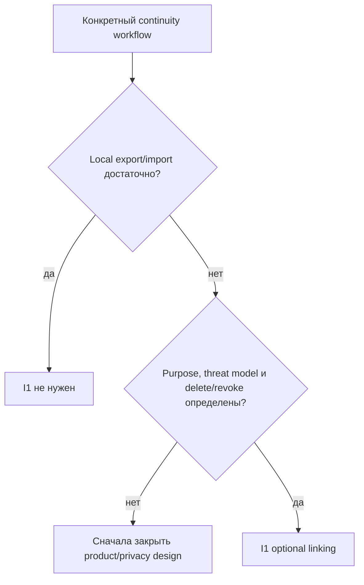

# Трек Identity Continuity

**Трек:** `I`  
**Роль:** условный cloud/recovery gate  
**Текущий статус:** `I1` не запланирован

Identity не является prerequisite для Core, telemetry или local Gamification и не должна незаметно превращаться в account system.

## Решение об активации



Допустимые trigger conditions:

- cross-device state;
- recovery после reinstall/OS loss;
- continuity утверждённого production ledger;
- entitlement/sync, который нельзя представить локально.

Желание «когда-нибудь иметь accounts» не является trigger.

## Identity model

```text
installation_id — случайная identity одной installation/profile
person_id       — отсутствует по умолчанию; появляется только через explicit opt-in
```

Один человек может иметь несколько installations, а installation может быть общей. `installation_id` не преобразуется автоматически в person identifier.

## I1 — Optional linking

### Dependencies

- конкретный workflow и data-purpose;
- отдельный threat model и privacy migration;
- stable state/ledger contract;
- export/delete/revoke semantics до implementation.

### Scope

- сравнение recovery file/code, passkey, OAuth/account и OS credential-store options;
- link/unlink/revoke/rotate/export/delete lifecycle;
- bounded replay/rate-limit/recovery controls;
- разделение identity, telemetry, entitlement и sync data;
- migration, rollback и recovery verification.

### Вне scope

- default account creation;
- retroactive linking;
- IP/MAC/machine GUID/hardware/browser fingerprinting;
- hidden identifiers;
- social/monetization features без отдельных stages.

### Completion

- `person_id` отсутствует по умолчанию;
- informed opt-in;
- unlink/revoke/export/delete проходят end to end;
- threat model и privacy migration approved;
- identifiers/secrets исключены из logs, screenshots, reports и CI artifacts.
