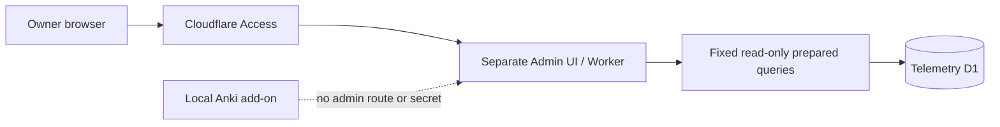

# Трек Telemetry Operations

**Трек:** `O`  
**Роль:** отдельные защищённые operational tools, не часть локального dashboard  
**Снимок решения:** `2026-07-26`

```text
O1.1 — Complete / integrated
O1.2 — Complete / integrated; not deployed
O1.3 — Complete / corrected / integrated; not deployed
O1.4 — Complete / integrated; not deployed
O1.5 — Next
O1.6 — Planned
```

Operations — независимый трек. Он не добавляет административные credentials,
routes или remote data в локальный add-on и не блокирует Core без явной
зависимости.

## Branch invariant

Работа Operations в этом repository:

```text
current core
-> operations
-> operations task branch
-> draft PR targeting operations
```

Обязательные правила:

- `operations` создаётся и синхронизируется только от актуального `core`;
- Operations PR target — только `operations`, никогда не `master`;
- `operations` не сливается в `core` без отдельного разрешения владельца;
- PR по умолчанию draft, auto-merge выключен;
- title/body и closeout пишутся по-русски с реальными переносами строк;
- merge, deployment и начало следующего этапа — отдельные решения владельца.

Git не позволяет одновременно иметь refs `operations` и `operations/...`,
поэтому task branch использует эквивалентное имя
`operations-o1-2-read-model-maintenance`.

## Архитектурная граница



Cloudflare Access остаётся внешней защитой, а интегрированный Admin Worker
самостоятельно валидирует Access JWT до route dispatch и D1. Provider token
доступен только отдельному Collector Worker; Admin Worker читает
materialized snapshots из изолированного `ADMIN_DB`. D1 остаётся server-side;
browser не задаёт SQL, table/column names, arbitrary grouping, sort или date
range.

## O1 — Telemetry Operations

### Цель

Дать владельцу bounded read-only evidence для:

- usage aggregates;
- ingestion/quota health;
- aggregation и retention freshness;
- consent/privacy/deletion state;
- будущих provider metrics;
- минимальной incident diagnostics.

Installation metrics не являются people/account metrics. Installation lookup,
raw-event explorer, arbitrary segmentation и two-dimensional analytics
запрещены.

### O1.1 — Metrics, Query and Security Contract

**Статус:** `Complete / integrated`
**Canonical review:** telemetry
[PR #19](https://github.com/AliceLiddell01/anki-study-report-telemetry/pull/19)
**Telemetry operations merge:** `8ef613d61c7b8672d9143b0c3b710c2d81b2fa6b`

Зафиксированы:

- audited application/provider source families;
- versioned Metric Registry и fixed Query Registry;
- typed empty/suppressed/incomplete/stale/unavailable/error states;
- primary и complementary suppression;
- no 2D query и no installation lookup;
- Access JWT/JWKS threat boundary;
- machine-readable validation и handoff.

O1.1 не реализует runtime endpoint, migration, Admin API/UI, Access resource,
provider credential или deployment.

Закрытый public PR #147 не используется: он был направлен в `master` и имел
сломанный literal-`\n` body. Его public-safe содержание перенесено на clean
Operations branch от текущего `core`.

### O1.2 — Operational Read Model and Maintenance Evidence

**Статус:** `Complete / integrated; not deployed`
**Canonical review:** telemetry
[PR #20](https://github.com/AliceLiddell01/anki-study-report-telemetry/pull/20)
**Telemetry operations merge:** `bb1ae3c7e42da22f917128b9becde04ba7b0b4d8`

Интегрированный Operations contract добавляет только:

- bounded daily totals;
- approved one-dimensional distributions;
- fixed-column component maintenance evidence и bounded per-day checkpoint;
- coverage и bounded incomplete reason codes;
- dirty/missing-day selection без unconditional eight-day rewrite;
- общий 20,000-row maintenance write budget с actual D1 metadata;
- explicit `capacity_budget_deferred` и `single_day_budget_exceeded`;
- atomic aggregate/read-model/checkpoint transaction;
- resumable bounded backfill;
- deletion-aware anonymous aggregate semantics;
- тот же two-year calendar-month cutoff, что у aggregates, и 60-day
  maintenance-evidence retention.

Не добавлены Admin API/UI, provider collector, Cloudflare Access resources,
external alerts, new client telemetry, retention expansion или deployment.

Final telemetry CI
[run 30193694403](https://github.com/AliceLiddell01/anki-study-report-telemetry/actions/runs/30193694403)
на head `86dcdae38c0044dee7e839ee2ff190d539b7cf57` прошёл, включая OSV.
Migration/deployment не выполнялись.

Application cap 20,000 accepted events остаётся abuse boundary, а не
доказательством совместимости с Workers Free. Production provider evidence,
reviewed lower cap или paid plan остаются отдельным решением.

### O1.3 — Protected Read-only Admin API

**Статус:** `Complete / integrated; not deployed`
**Canonical review:** telemetry
[PR #21](https://github.com/AliceLiddell01/anki-study-report-telemetry/pull/21)
**Final telemetry head:** `755511ce20ffc65046503b2504d9edf6d7564e4f`
**Telemetry operations merge:** `1acb7abc6d9f2347ce59e3f2b52da3a0728140bb`

Интегрированный scope:

- отдельный protected Admin Worker/API без изменения ingestion Worker;
- strict RS256 Access JWT/JWKS validation до route dispatch и D1;
- machine map всех 21 Query Registry operations;
- 17 active fixed SELECT-only operations и 4 typed unavailable без D1;
- server-owned UTC boundaries, sort, dimensions и row caps;
- seven-state typed response envelope;
- primary/complementary suppression, включая stale/incomplete cells;
- fail-closed authorization, static SQL validation и before/after D1
  no-mutation proof для каждой active operation;
- отдельная fail-closed Wrangler config с placeholders, но без deployment.

Final telemetry CI
[run 30196888155](https://github.com/AliceLiddell01/anki-study-report-telemetry/actions/runs/30196888155)
на exact head прошёл, включая OSV. O1.3 не создавал Access application/policy,
не применял remote D1 migration и не выполнял staging/production deployment.
UI и provider collector не входят в этап.

Corrective fix в составе O1.4 integration закрывает registry-wide differencing
paths, сохраняет наблюдаемый exact zero отдельно от empty и уточняет
source-specific coverage. Исправление принято тем же telemetry PR #22 без
расширения deployment boundary.

### O1.4 — Provider Metrics Collector

**Статус:** `Complete / integrated; not deployed`
**Canonical review:** telemetry
[PR #22](https://github.com/AliceLiddell01/anki-study-report-telemetry/pull/22)
**Final telemetry head:** `03ad15c15917c192878a6fa4900430772964c95c`
**Telemetry operations merge:** `ebae6f71ec0dcf2ba044faf9dff2a58cde474263`

Интегрированный scope:

- отдельный no-route Collector Worker с least-privilege provider token;
- изолированный `ADMIN_DB`, недоступный public ingestion Worker;
- fixed pre-reviewed GraphQL templates без browser-controlled query surface;
- bounded timeout, response size, retry и fail-closed parsing;
- только завершённые provider intervals, bounded recent/backfill windows и
  90-day retention;
- idempotent scheduled runs, stale-run reconciliation и independent component
  checkpoints;
- conservative provider-reported precision без преобразования неизвестной
  sampling metadata в exact;
- source-specific freshness и typed unavailable/incomplete states в Admin API;
- provider token отсутствует в Admin Worker и не сохраняется в D1.

Final telemetry CI
[run 30200494159](https://github.com/AliceLiddell01/anki-study-report-telemetry/actions/runs/30200494159)
на exact head прошёл, включая OSV. Live GraphQL, remote migrations, Cloudflare
resource mutation, staging/production deployment и Cron activation не
выполнялись.

### O1.5–O1.6

- `O1.5` — **Next**: minimal Admin Console поверх принятых fixed API operations;
- `O1.6` — verification, runbook и отдельный production gate.

Каждый этап требует отдельного scope и owner decision.

## Общие границы

Вне O1 без отдельного решения:

- hidden admin mode в add-on/dashboard;
- arbitrary SQL или generic query endpoint;
- installation/account identity и raw-event explorer;
- two-dimensional or user-level analytics;
- browser provider credentials;
- Cloudflare resource mutation;
- staging/production deployment;
- release или merge в `core`/`master`.
