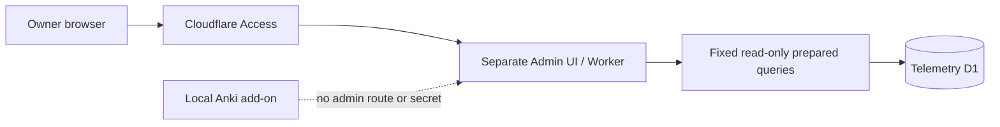
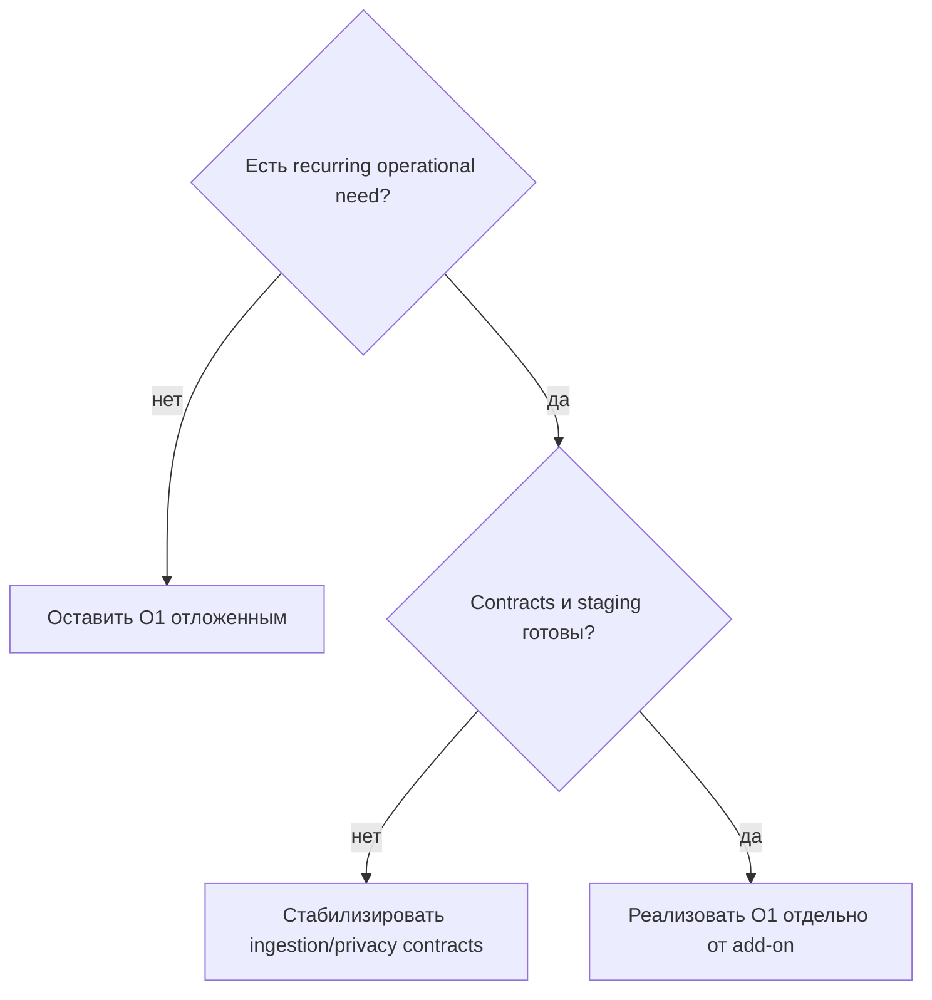

# Трек Telemetry Operations

**Трек:** `O`  
**Роль:** отдельные защищённые operational tools, не часть локального dashboard  
**Текущий статус:** `O1` — условно запланирован

Текущий telemetry service — opt-in ingestion Worker с узкой public surface. Он не создаёт пользовательские accounts, generic query API или скрытый admin mode в add-on.

## Архитектурная граница

Worker обязан самостоятельно валидировать Access JWT/audience. D1 остаётся server-side; filters allowlisted, queries prepared.

## O1 — Telemetry Admin Analytics Dashboard

### Trigger

Активировать только когда recurring operational work требует регулярного безопасного чтения агрегатов, например:

- ручная D1 inspection повторяется;
- ingestion/retention/deletion health требует наблюдения;
- telemetry volume делает ad-hoc inspection ошибочным;
- incidents требуют bounded read-only diagnostic surface.

### Scope

- usage aggregates и system health;
- versions/environment и bounded event distributions;
- performance/error/quota buckets;
- consent, retention, expiry, deletion и consistency status;
- fixed period/filter allowlists;
- synthetic-only staging;
- rollback и fail-closed authorization tests.

### Вне scope

- route или hidden admin mode в локальном dashboard;
- arbitrary SQL/query endpoint;
- raw study content;
- admin secrets в add-on/frontend/browser storage;
- mutations над installations/events;
- generic analytics platform.

### Completion

- Access и Worker JWT validation fail closed;
- API read-only, typed, bounded и prepared;
- staging использует synthetic data;
- privacy/deletion metrics не восстанавливают удалённые payloads;
- deployment/rollback/security verification документированы;
- production deployment требует отдельного approval.

Official references остаются частью implementation research:

- https://developers.cloudflare.com/cloudflare-one/access-controls/applications/http-apps/
- https://developers.cloudflare.com/cloudflare-one/access-controls/applications/http-apps/authorization-cookie/validating-json/
- https://developers.cloudflare.com/d1/worker-api/prepared-statements/
