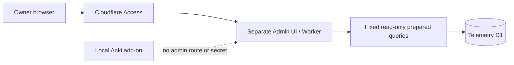

# Трек Telemetry Operations

**Трек:** `O`  
**Роль:** отдельные защищённые operational tools, не часть локального dashboard  
**Снимок решения:** `2026-07-26`

```text
O1.1 — Complete / reviewable contract
O1.2 — Review
O1.3 — Planned
O1.4–O1.6 — Planned
```

Operations — независимый трек. Он не добавляет административные credentials,
routes или remote data в локальный add-on и не блокирует Core без явной
зависимости.

## Branch invariant

Работа Operations в этом repository:

```text
current core
-> operations
-> operations task branch
-> draft PR targeting operations
```

Обязательные правила:

- `operations` создаётся и синхронизируется только от актуального `core`;
- Operations PR target — только `operations`, никогда не `master`;
- `operations` не сливается в `core` без отдельного разрешения владельца;
- PR по умолчанию draft, auto-merge выключен;
- title/body и closeout пишутся по-русски с реальными переносами строк;
- merge, deployment и начало следующего этапа — отдельные решения владельца.

Git не позволяет одновременно иметь refs `operations` и `operations/...`,
поэтому task branch использует эквивалентное имя
`operations-o1-2-read-model-maintenance`.

## Архитектурная граница



Cloudflare Access будет внешней защитой, но будущий Admin Worker обязан
самостоятельно валидировать Access JWT, issuer, audience, время действия и
JWKS rotation. D1 остаётся server-side; browser не задаёт SQL, table/column
names, arbitrary grouping, sort или date range.

## O1 — Telemetry Operations

### Цель

Дать владельцу bounded read-only evidence для:

- usage aggregates;
- ingestion/quota health;
- aggregation и retention freshness;
- consent/privacy/deletion state;
- будущих provider metrics;
- минимальной incident diagnostics.

Installation metrics не являются people/account metrics. Installation lookup,
raw-event explorer, arbitrary segmentation и two-dimensional analytics
запрещены.

### O1.1 — Metrics, Query and Security Contract

**Статус:** `Complete / reviewable contract`
**Canonical review:** telemetry
[PR #19](https://github.com/AliceLiddell01/anki-study-report-telemetry/pull/19)

Зафиксированы:

- audited application/provider source families;
- versioned Metric Registry и fixed Query Registry;
- typed empty/suppressed/incomplete/stale/unavailable/error states;
- primary и complementary suppression;
- no 2D query и no installation lookup;
- Access JWT/JWKS threat boundary;
- machine-readable validation и handoff.

O1.1 не реализует runtime endpoint, migration, Admin API/UI, Access resource,
provider credential или deployment.

Закрытый public PR #147 не используется: он был направлен в `master` и имел
сломанный literal-`\n` body. Его public-safe содержание перенесено на clean
Operations branch от текущего `core`.

### O1.2 — Operational Read Model and Maintenance Evidence

**Статус:** `Review`
**Canonical review:** telemetry
[PR #20](https://github.com/AliceLiddell01/anki-study-report-telemetry/pull/20)

Review candidate добавляет только:

- bounded daily totals;
- approved one-dimensional distributions;
- fixed-column component maintenance evidence;
- coverage и bounded incomplete reason codes;
- idempotent complete-day rebuild;
- resumable bounded backfill;
- deletion-aware anonymous aggregate semantics;
- 24-month aggregate/read-model и 60-day maintenance-evidence retention.

Не добавлены Admin API/UI, provider collector, Cloudflare Access resources,
external alerts, new client telemetry, retention expansion или deployment.

O1.2 нельзя отмечать `Complete`, пока exact-head cloud CI и PR metadata не
подтверждены и владелец отдельно не решил integration в `operations`.

### O1.3 — Protected Read-only Admin API

**Статус:** `Planned`

Минимальный scope после owner-approved O1.2 integration:

- отдельный protected Admin Worker/API;
- strict Access JWT/JWKS validation;
- только active fixed Query Registry operations;
- static read-only prepared templates и server-owned UTC boundaries;
- typed response envelope;
- primary/complementary suppression;
- fail-closed authorization и before/after D1 no-mutation proof.

O1.3 не включает UI, provider collector или production deployment.

### O1.4–O1.6

- `O1.4` — least-privilege provider metrics collector и bounded snapshots;
- `O1.5` — minimal Admin Console поверх принятых fixed API operations;
- `O1.6` — verification, runbook и отдельный production gate.

Каждый этап требует отдельного scope и owner decision.

## Общие границы

Вне O1 без отдельного решения:

- hidden admin mode в add-on/dashboard;
- arbitrary SQL или generic query endpoint;
- installation/account identity и raw-event explorer;
- two-dimensional or user-level analytics;
- `ADMIN_DB` до provider collector;
- browser provider credentials;
- Cloudflare resource mutation;
- staging/production deployment;
- release или merge в `core`/`master`.
