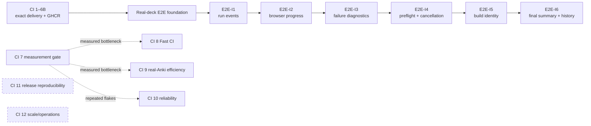
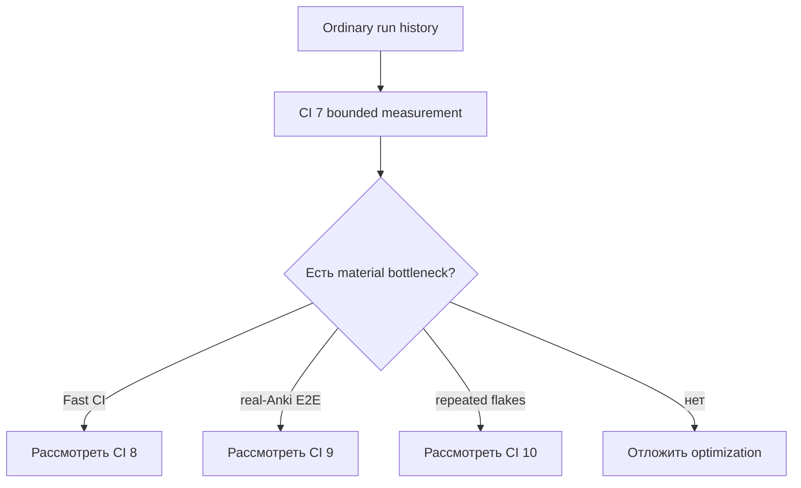

# Roadmap Platform / CI

Platform-трек развивает delivery, packaging и real-Anki E2E независимо от продуктовых stages.

## Карта delivery contour



## Текущее состояние

```text
CI 1–6B — COMPLETE
real-deck E2E foundation — COMPLETE / merged
E2E-I1 — COMPLETE / merged
E2E-I2 — COMPLETE / merged
E2E-I3 — COMPLETE / merged
E2E-I4 — COMPLETE / merged через PR #137
E2E-I5 — COMPLETE / cloud acceptance через PR #141
E2E-I6 — следующий planned stage
CI 7–12 — conditional
```

## Current invariants

```text
cloud environment: immutable GHCR digest
manual package: exact successful Fast CI artifact
release package: exact release artifact
collection source: three committed real APKG
package identity and harness identity: separate
harness reuse: ancestry + complete-diff fail closed
run events: current schema v2; historical v1 validated
failure summary: schema v1, failure-only
cancellation summary: schema v1 + run/cancel
preflight: deterministic 20-check static/runtime report
non-release build identity: schema v1, digest over canonical identity only
browser: plan v1, report v3, 23 items, 18 screenshots
```

Новый Fast CI package создаётся только при package-impacting diff либо когда exact artifact недоступен/невалиден. Allowlisted harness-only changes могут использовать existing package через fail-closed validator.

## Текущий roadmap E2E-I1–I6

- [Полный roadmap observability/build identity](e2e-observability-build-identity.md)
- [Run-event contract](../../docs/run-event-protocol.md)
- [Failure diagnostics](../../docs/failure-diagnostics.md)
- [Preflight и cancellation](../../docs/e2e-preflight-cancellation.md)
- [Package/harness reuse](../../docs/e2e-package-harness-reuse.md)
- [Non-release build identity](../../docs/non-release-build-identity.md)

Исторические SHA, run IDs и artifacts: [reports/ci](../../reports/README.md).

## Условные optimization tracks

CI 7 — measurement gate, а не автоматическое разрешение менять caches, runners, retries, splitting или coverage.



Не более одного optimization candidate активируется одновременно. Он обязан иметь baseline, expected benefit, cost, risk и stop condition.

## Общие правила

- сначала ordinary run history, затем controlled runs;
- не повторять successful unchanged package/harness pair;
- Docker E2E — integration gate, не debugger;
- retries не заменяют root-cause fix;
- performance thresholds требуют отдельного measurement decision;
- docs-only commits после successful gates не требуют нового Fast CI/Docker;
- завершение E2E-I stage не запускает следующий автоматически;
- Platform не меняет product scope без documented dependency.
