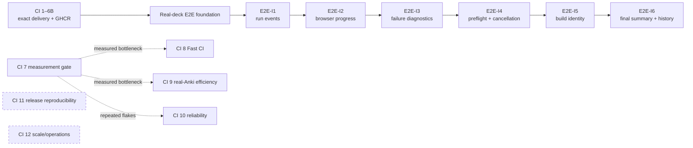
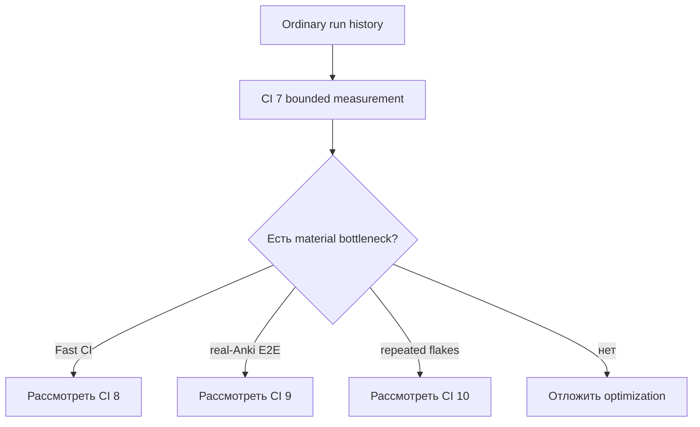

# Roadmap Platform / CI

Platform-трек развивает delivery, packaging и real-Anki E2E независимо от продуктовых stages.

## Карта delivery contour



## Текущее состояние

```text
CI 1–6B — ЗАВЕРШЕНО
основа E2E на реальных колодах — ЗАВЕРШЕНО / влито
E2E-I1 — ЗАВЕРШЕНО / влито
E2E-I2 — ЗАВЕРШЕНО / влито
E2E-I3 — ЗАВЕРШЕНО / влито
E2E-I4 — ЗАВЕРШЕНО / влито через PR #137
E2E-I5 — ЗАВЕРШЕНО / влито через PR #141
E2E-I6 — ЗАВЕРШЕНО / влито через PR #142
E2E-I6 bounded corrective fix — PASS / PR #144 открыт, не влит
core merge SHA E2E-I6 — 52731abb2fae682c97c3d0d9a542c250c6f25ea8
CI 7–12 — условные; ни один этап не активирован
```

Corrective PR #144 исправляет только footprint category projection и producer current values в regression observations. Облачная приёмка пройдена на `afe650adbf3ba55cb6b59068a1127022b651fbf3`: Fast CI `30169763775`, telemetry-enabled `standard/full` `30169890912`, main artifact `8622647178`, history `append / 2 entries`. Это bounded исправление завершённого E2E-I6, а не новый roadmap stage.

## Current invariants

```text
облачное окружение: неизменяемый digest GHCR
ручной пакет: точный успешный артефакт Fast CI
release-пакет: точный release-артефакт
источник коллекций: три committed real APKG
идентичности package и harness разделены
повторное использование harness: ancestry + полный diff, fail closed
события запуска: текущая schema v2; историческая v1 проверяется
сводка ошибки: schema v1, только для failure
сводка отмены: schema v1 + run/cancel
предварительная проверка: детерминированный отчёт из 20 static/runtime checks
идентичность нерелизной сборки: schema v1, digest только по canonical identity
каноническая итоговая сводка: final-run-summary.json schema v1, максимум 64 KiB
bounded history: 90 дней / 120 записей / 30 записей на compatibility key
регрессионные наблюдения: informational-only, без blocking threshold
browser: plan v1, report v3, 23 элемента, 18 screenshots
```

Новый Fast CI package создаётся только при package-impacting diff либо когда exact artifact недоступен/невалиден. Allowlisted harness-only changes могут использовать existing package через fail-closed validator.

## Roadmap E2E-I1–I6

- [Полный roadmap observability/build identity](e2e-observability-build-identity.md)
- [Run-event contract](../../docs/run-event-protocol.md)
- [Failure diagnostics](../../docs/failure-diagnostics.md)
- [Preflight и cancellation](../../docs/e2e-preflight-cancellation.md)
- [Package/harness reuse](../../docs/e2e-package-harness-reuse.md)
- [Идентичность нерелизной сборки](../../docs/non-release-build-identity.md)
- [Каноническая итоговая сводка и bounded history](../../docs/e2e-final-summary-history.md)

Исторические SHA, run IDs и artifacts: [reports/ci](../../reports/README.md).

## Условные optimization tracks

CI 7 — measurement gate, а не автоматическое разрешение менять caches, runners, retries, splitting или coverage.



Не более одного optimization candidate активируется одновременно. Он обязан иметь baseline, expected benefit, cost, risk и stop condition.

## Общие правила

- сначала ordinary run history, затем controlled runs;
- не повторять successful unchanged package/harness pair;
- Docker E2E — integration gate, не debugger;
- retries не заменяют root-cause fix;
- performance thresholds требуют отдельного measurement decision;
- docs-only commits после successful gates не требуют нового Fast CI/Docker;
- завершение E2E-I stage не запускает следующий автоматически;
- Platform не меняет product scope без documented dependency.
