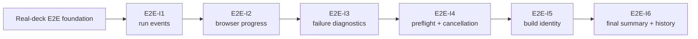

# Roadmap наблюдаемости E2E, диагностики и идентичности сборки

**Статус:** `COMPLETE`; `E2E-I1–E2E-I6` завершены и влиты.
**Снимок:** 2026-07-26
**Трек:** Platform / CI
**База:** real-deck E2E foundation из PR #133

## Назначение

Этот roadmap последовательно сделал real-Anki execution contour наблюдаемым и однозначным без ручного восстановления результата по PowerShell, Bash, Python, Node.js и GitHub Actions.

Он состоял ровно из шести крупных этапов. Implementation tasks и commits не создавали дополнительных roadmap-уровней `I2.1`, `I2a` и подобных.

## Общие инварианты

Ни один этап не должен был:

- ослаблять exact package identity;
- разрешать cloud source-build fallback;
- менять production payload только на одной стороне;
- открывать dashboard server наружу;
- логировать dashboard token или token-bearing URL;
- ослаблять sanitizer, media validation, action allowlists или APKG checks;
- коммитить runtime artifacts, screenshots, logs, tokens или `.ankiaddon`;
- заменять real-Anki gate synthetic-only tests;
- добавлять retries вместо устранения root cause;
- превращать item progress в dynamic global phase registry;
- вводить performance threshold без отдельного measurement decision.

Внутренний контракт определяется production code, tests и актуальными документами из `docs/`. Этот roadmap фиксирует последовательность и границы, а `reports/` хранит исторические run identities.

## Итоговая карта



| Этап | Результат | Contract | Closeout |
| --- | --- | --- | --- |
| E2E-I1 | единый schema-versioned live run protocol | [Run-event protocol](../../docs/run-event-protocol.md) | [I1 closeout](../../reports/ci/e2e-i1-unified-live-run-protocol-closeout.md) |
| E2E-I2 | детерминированный прогресс browser smoke | [Docker E2E](../../docs/docker-e2e.md) | [I2 closeout](../../reports/ci/e2e-i2-browser-smoke-progress-closeout.md) |
| E2E-I3 | stable failure taxonomy и canonical failure evidence | [Failure diagnostics](../../docs/failure-diagnostics.md) | [I3 closeout](../../reports/ci/e2e-i3-stable-failure-diagnostics-closeout.md) |
| E2E-I4 | отдельные preflight и cancellation lifecycle | [Preflight и cancellation](../../docs/e2e-preflight-cancellation.md) | [I4 closeout](../../reports/ci/e2e-i4-cancellation-preflight-closeout.md) |
| E2E-I5 | точная идентичность нерелизной сборки | [Non-release build identity](../../docs/non-release-build-identity.md) | [I5 closeout](../../reports/ci/e2e-i5-non-release-build-identity-closeout.md) |
| E2E-I6 | canonical final summary, bounded history и observational reporting | [Final summary and history](../../docs/e2e-final-summary-history.md) | [I6 closeout](../../reports/ci/e2e-i6-final-summary-history-closeout.md) |

## E2E-I1 — Единый live run protocol

**Статус:** `COMPLETE`, merged через PR #134.

Реализованы deterministic UTF-8 JSONL events, stable run/phase registries, cross-process append/locking, immediate console output и success/failure/cancel lifecycle для Fast CI и Docker E2E.

## E2E-I2 — Прогресс browser smoke

**Статус:** `COMPLETE`, merged через PR #135.

Реализованы deterministic browser plan, 23 stable items, 18 screenshots, per-item progress, partial failure report и fail-closed screenshot parity без миграции на `@playwright/test`.

## E2E-I3 — Stable failure diagnostics

**Статус:** `COMPLETE`, merged через PR #136.

Реализованы reviewed stable failure codes, canonical `failure-summary.json`, immutable primary failure, bounded secondary failures, safe evidence paths и parity между run event, browser report и public artifact.

## E2E-I4 — Cancellation и preflight

**Статус:** `COMPLETE`, merged через PR #137.

Реализованы deterministic static/runtime preflight, отдельный `cancellation-summary.json`, signal/exit parity, process-group forwarding, bounded cleanup и controlled cancellation acceptance.

## E2E-I5 — Идентичность нерелизной сборки

**Статус:** `COMPLETE`, merged через PR #141.

Реализованы closed schema v1, canonical identity digest, независимые package/harness/workflow/environment identities, режимы `exact-tree` и `harness-only`, raw/public parity и fail-closed reuse.

## E2E-I6 — Каноническая итоговая сводка и история

**Статус:** `COMPLETE`, merged через PR #142.

### Реализовано

- один canonical `reports/final-run-summary.json` schema v1;
- closed deterministic schema с лимитом 64 KiB;
- `success|failure|cancelled` и `complete|partial|minimal|unavailable`;
- terminal truth из structured evidence, без парсинга console text;
- отсутствие fake build identity при setup/preflight failure;
- raw/public semantic parity и SHA-256 exact public bytes;
- derived legacy JSON/Markdown projection без независимого inference;
- compatibility key для сопоставимых contours;
- отдельный candidate key для release/non-release identity;
- bounded history: 90 дней, максимум 120 записей, максимум 30 на compatibility key;
- first-run pass eligibility и явные exclusion reasons;
- inclusive p50 при минимум 3 samples и p95 при минимум 20 samples;
- artifact footprint до upload и artifact metadata только в history entry;
- compact history artifact с точным allowlist из пяти файлов;
- observational-only regression report без CI blocking threshold;
- compact GitHub Step Summary;
- success/failure/cancellation/preflight lifecycle integration;
- fail-closed GitHub artifact transport и bounded cancellation evidence.

### Принятый кандидат

```text
PR: #142
implementation HEAD: 00e1e98f91b454a1fa0c5fef5b3530884f01ec32
docs/report head перед merge: 34498a03e2ce7b8aa2fe2ccef13a92ae2da42bf5
core merge SHA: 52731abb2fae682c97c3d0d9a542c250c6f25ea8
Fast CI: 30166328801 — PASS
standard/full: 30166561184 — PASS
main artifact: 8621761591
main digest: sha256:11dc6f3963dbd6b91059cdab27260bb7c1b41237d11d0adb8df4a36ca662fe05
history artifact: 8621762124
history digest: sha256:0e545d0e46f87adaac8e1f73ef8ae864fc2df3234a05f9825340dc4ff6cb9c5c
canonical result: success / complete / run/pass
history: bootstrap / 1 entry
```

### Сохранённые границы

- нет blocking performance thresholds;
- нет runner/cache/retry/split optimization;
- нет external telemetry/history service;
- нет warm-cache repeat;
- нет второго unchanged successful E2E;
- product/API/UI scope не изменён;
- release provenance не переработан.

## Verification policy

1. Классифицировать diff как package-impacting, harness-only или docs-only.
2. Запускать focused tests и syntax checks до cloud gate.
3. Новый Fast CI запускать только по package/reuse boundary.
4. Выполнять ровно один risk-required real-Anki proof после последнего concrete fix.
5. После failure сначала изучать artifact/log/root cause.
6. Не повторять successful unchanged package/harness pair.
7. Docs-only closeout после successful gates не требует нового Docker/Fast CI.

## Security boundary

Structured progress/failure/build/history evidence может содержать только stable IDs, bounded enums, durations/counts, safe relative paths, exact public SHA/digest identities и sanitized summaries.

Запрещены token/credentials, token-bearing URL, authorization headers, private absolute paths, card HTML/user content, arbitrary environment dump и raw stack в live progress.

## Следующий допустимый шаг

Активного продолжения у E2E-I roadmap нет.

CI 7–12 остаются условными. Любой optimization stage активируется только отдельным решением владельца после измеренного bottleneck, повторяющихся flakes либо конкретного release/scale trigger. Завершение E2E-I6 не активирует их автоматически.
